

    <h1 style="border:none">Universidad ORT Uruguay</h1>
    <h2 style="border:none">Facultad de Ingeniería</h2>
    

    <h2 style="border:none">Ingeniería de software ágil 1</h2>
    <h2 style="border:none">Obligatorio</h2>
    

    <h3 style="border:none">Entregado como requisito de la materia Ingeniería de software ágil 1</h3>
    

    <h3 style="border:none">Equipo:</h3>
    <h4 style="border:none">Tomas Amado - 268467</h4>
    <h4 style="border:none">Danilo Biladoniga - 231749</h4>
    <h4 style="border:none">Romina Giaccio - 206127</h4>
    <h4 style="border:none">German Oller - 242312</h4>
    

    <h3 style="border:none;">Docentes:</h3>
    <h4 style="border:none;">Fabiana Pedrini Fein</h4>
    <h4 style="border:none;">Analía Stéfanie Moreira Rodríguez</h4>

    <h1 align="center">Indice</h1>
    <ol> 
        <li>Inicio</li>
        <ol>
            <li></li>
        </ol>
        <li>Sprint 1</li>
        <ol>
            <li></li>
        </ol>
        <li>Sprint 2</li>
        <ol>
            <li></li>
        </ol>
        <li>Sprint 3</li>
        <ol>
            <li></li>
        </ol>
        <li>Sprint 4</li>
        <ol>
            <li></li>
        </ol>
    </ol>

    <h1 align="center">Inicio</h1>

## Adaptación de SCRUM 

Sprint Planning:
En Sprint Planning hemos seguido los consejos de la guia SCRUM y cada una de sus secciones, que son las siguientes: 
 - Why is this Sprint valuable?
 - What can be Done this Sprint?
 - How will the chosen work get done?

Daily:
Nuestras dailys en vez de tener un largo de 15 minutos, tuvieron un largo promedio de 30 minutos, esta adaptación nos ha beneficiado para coordinar mejor el progreso de cada Sprint, dandole al equipo una velocidad adecuada de trabajo.

Sprint Review:
En nuestro caso no han sido incluidos Stake Holders a las Sprint Review, si no que hemos hecho hincapié en la opinión del Product Owner. 
Todas las Sprint Review se han realizado al terminar un Sprint y han tenido un largo promedio de 15 minutos.

Sprint Retrospective:
Nuestras Sprint Retrospectives han durado en promedio 25 minutos lo cual es comprensible debido a que nuestros sprints tienen una duración de 2 semanas. 

Añadido a lo anterior estos eventos de SCRUM fueron llevados a cabo de forma que siguieran lo mas posible los parámetros establecidos por la guía de SCRUM. 

## Eventos SCRUM

Sprint Planning - Primer Viernes despues del comienzo del Sprint alrededor de 17:30.

El Sprint Planning es una reunión que se realiza al comienzo de cada Sprint donde participa
el equipo Scrum al completo; sirve para inspeccionar el Product Backlog y que el equipo de 
desarrollo seleccione las historias de usuario en los que va a trabajar durante el siguiente Sprint.
Estas historias son los que compondrán el Sprint Backlog.

Daily - Lunes, Miercoles y Viernes por Whatsapp a las 13:00.

La Daily es una reunión recurrente de aproximadamente 15 minutos en la que participa exclusivamente el Development Team.

En esta reunión todas y cada una de las personas del Development Team responden a las siguientes preguntas:

¿Qué hice ayer para contribuir al Sprint Goal?
¿Qué voy a hacer hoy para contribuir al Sprint Goal?
¿Tengo algún impedimento que me impida entregar?

Sprint Review - El día antes a la entrega. (Sábado o Domingo)

La Sprint Review es una reunión en la cual el Development team muestra al Product Owner el incremento realizado en el sprint actual
y el Product Owner puede dar feedback sobre las tareas realizadas.

Esta reunión ocurre al final del Sprint y antes de la retrospective.

Sprint Retrospective - El día antes a la entrega. (Sábado o Domingo).
Utilizaremos [Metroretro](https://metroretro.io/) como herramienta para las restrospectivas.

La Sprint Retrospective es una reunión en la cual el Development team analiza su actuación y desempeño durante el Sprint
en busca de mejorar para el proximo Sprint. 

En esta generalmente se utilizan herramientas como Metroretro que le permiten al equipo participar de forma anónima
y poder compartir las diferentes opiniones sobre los resultados y/o problemas que tuvieron en el Sprint.

Esta reunión ocurre al final del Sprint generalmente sucede después de la Sprint Review.

## Roles

- Scrum Master - Tomas
    El rol incluye liderar al equipo en el marco de SCRUM, 
    permitiendo mejorar la agilidad del mismo para una entrega de mejor valor al cliente.

    Este debe la responsabilidad de que se sigan las practicas de SCRUM y sus principios.

- Product Owner - Romina
    El rol incluye encargarse de crear las historias de usuario junto al equipo de desarrollo,
    aclarar dudas respecto al producto y que historia brinda valor.

    También este se encarga de priorizar el Product Backlog para poder tomar las historias para
    las siguientes iteraciones, y que estas brinden el mayor valor posible.

    También se encarga, no unicamente, de validar que estas historias esten completas y que el
    objetivo del sprint se haya cumplido, esto sucede en la Sprint Review.

- Development Team - Todos
    Encargados de toda la parte que sea desarrollo y asimismo también participaran de los eventos
    de SCRUM.

## Estategias de branching

Utilizaremos GitFlow como estrategia de branching con un leve cambio, agregamos un nuevo tipo de rama llamada <strong>bug/X</strong> para diferenciar los bugs de los hotfixes.

- Main - Rama principal.

- Dev - Rama de desarollo. Esta sera la rama donde se mergeara los cambios realizados para cada iteracion.

- feature/X - Feature sobre historia X a desarollar.

- hotfix/X - Hotfix sobre historia X ya desarollada.

- bug/X - Fix de bug sobre historia X.

- document/X - Documentación nueva/modificada.

## Estategias de Pull request

Seguiremos la siguiente estrategia para los pull requests, y al final de cada sprint se creara un pull request de <strong>dev</strong> a <strong>main</strong> para pushear los cambios realizados sobre la iteración.

- feature/X - Feature sobre historia X a desarrollar.

- hotfix/X - Hotfix sobre historia X ya desarrollada.

- bug/X - Fix de bug sobre historia X.

- document/X - Documentación actualizada.

## Politicas de Trabajo

### Definition of Ready

Consideraremos que una Historia de Usuario estará lista para desarrollarese cuando cumpla con las siguientes consideraciones:

- La misma este bien definida.

- Criterios de aceptación definidos.

- La persona encargada de trabajar en la misma debe estar asignada.

Además de esto debe cumplir con el criterio INVEST: Independiente, Negociable, Valiosa, Estimable, Corta (Short) y Testeable.

Es decir, para que una Historia de Usuario sera incluida en el siguiente Sprint por el equipo de desarrollo debe presentar las siguientes características:

- Independiente: no tendrá dependencias con otras historias que pudieran impedir su desarrollo. Por tanto, si para que la funcionalidad A sea posible es necesario tener la B, entonces la historia A no es independiente.

- Negociable: debe permitir espacio para la discusión con el Product Owner.

- Valiosa: debe aportar valor al cliente. Cumpliendo este criterio evitas desarrollar algo inútil.

- Estimable: puede ser estimada por el DevTeam (en tamaño relativo, en puntos de historia, etc).

- Corta: debe poder terminarse durante el Sprint. Si se encuentra una Historia demasiado grande, eso exige al Product Owner que la subdivida en varias Historias más pequeñas.

- Testeable: la Historia en su descripción debe contar con la información suficiente como para poder ser probada.

### Definition of Done

Consideraremos que una Historia de Usuario estará terminada cuando cumpla con las siguientes caracteristicas:

- Existencia de prototipo sobre la Historia de Usuario.

- Se debe cumplir con el requerimiento funcional del negocio y criterios de aceptación.

- No deben existir defectos conocidos.

- Debe estar integrada con el resto del prototipo.

- Review sobre los cambios realizados por al menos 2 reviewers.

- Documentacion actualizada sobre los cambios realizados.

- Se debe seguir cumpliendo con los requerimientos no funcionales

### Requerimientos no funcionales

- Seguridad: El sistema debe ser seguro, es decir, no debe permitir que un usuario no autorizado pueda acceder a la información del sistema.

- Usabilidad: El sistema debe ser fácil de usar, es decir, debe ser intuitivo y fácil de aprender.

- Performance: El sistema debe poder manejar grandes cantidades de usuarios sin haber ninguna desgradación en la velocidad de la aplicación.

- Compatibilidad: El sistema debe ser compatible para sistemas operativos iOS y Android.

    <h1 align="center">Sprint 1</h1>

## Objetivo del Sprint

Identificar el problema y definir una solucion al mismo.

## Sprint Planning

Definimos que tareas teniamos que hacer, entrevistas, encuestas, etc. Nos dividimos algunas tareas.
Definimos el marco de SCRUM y que eventos y roles vamos a seguir y/o tomar.

## Ejemplo Daily

Investigue sobre Moovit, pros, cons, requisitos, me junte con Romi para ver un poco como empezar el backlog pero no empezamos aun a definirlo.

[Dailies Sprint 1](Sprint1/Dailies.md)

## Sprint Review

Nos juntamos con el Product Owner para hacer la review.

En esta meeting revisamos el backlog con el PO y fuimos historia a historia hablando de cada una y discutiendo si estabamos de acuerdo entre todos, preguntando (Dev team) al PO sobre las historias para mas claridad sobre cada una.

Obtuvimos feedback y se agregaron nuevas historias de usuario que faltaban, entre ellas descargar el mapa y pago de boletos desde la app.

## Retrospective

Utilizamos metroretro para hacer la retrospective.

### Reflexión de la retro y oportunidades de mejora
  Durante la retrospectiva los resultados demostraron que el equipo estuvo de acuerdo en que la principal problemática presentada fue la falta de tiempo, se consideró la causa que produjo este problema y las reflexiones a partir de esto fueron las siguientes:

  * La falta de tiempo está ligada a que somos un grupo de 4 personas que trabajan y estudian, lo cual no es algo que se pueda modificar, se consideraron como factores sobre los que no se puede actuar. 
  * La falta de tiempo también está ligada a la organización de las diferentes tareas de los integrantes del equipo.

	En esta segunda instancia para resolver estas problemáticas se planteó como mejora separar el trabajo de forma de que cada integrante tenga al menos una tarea en la que pueda avanzar en paralelo con respecto al resto del equipo, lo cual hace más posible que cada integrante pueda acomodar este trabajo a su horario personal. 
  Otra solución propuesta es que las reuniones a las que puedan asistir todos los integrantes del equipo se enfoquen en aquellas actividades que los requieren a todos, realizando más reuniones de una duración menor, 1 hora como máximo.

  Por otra parte, se analizaron aspectos positivos del equipo, como el apoyo entre los integrantes, la sincronía de pensamiento y compromiso en la participación de cada instancia.
  
# Investigacion Moovit

### Cumple con los requisitos

- Tiene notificaciones
- No cuenta con login ni registro de usuarios
- Cuenta con busqueda pero no tiene filtros.
- Cuenta con mapa en vez de listado, de estaciones cercanas al usuario pero no dice cantidad de usuarios en la linea, solamente recorrido, hora de salida y llegada a destino.
- Posee historial de lineas recientemente usadas o vistas.
- Posee modo viaje.
- Se puede compartir los viajes con otros usuarios.

### Pros

- Usa localizacion en tiempo real.
- Se puede setear donde queda el domicilio del usuario.
- Se puede marcar como favoritas las lineas de bus que el usuario desee.
- Se puede reportar varias cosas:
  - La linea estaba llena y no se pudo subir.
  - La data de la aplicacion era incorrecta.
  - Estado del servicio.
- Se puede pedir un Uber desde la app.
- Se puede buscar por calle a donde se quiera ir, y la app sugiere lineas para llegar al destino.
- Posee modo oscuro y modo claro.
- La informacion es clara y concisa.
- La interfaz es comoda de usar y se entiende.
- Posee mapa lo cual ayuda a visualizar donde se encuentra el usuario y donde esta el destino.

### Cons

- Tiene ads requiere de version premium para poder removerlos.
- Al usar geolocalizacion puede que consuma mucha bateria y datos.
- No cuenta con mas informacion sobre el historial del usuario
- No se puede descargar como PDF los datos.
- No cuenta con traqueo de precios de las lineas.
- La lista de recientes indica todos los lugares que se propusieron como puntos de destino/origen/favoritos sin importar si se llavo a cabo el viaje.

### Observaciones

- Muy facil de usar.
- Intuitiva y facil de navegar
- Buen diseño

# Investigacion: STM

### Cumple con los requisitos

- No cuenta con: login, registro de usuarios o contrasenias
- Cuenta con filtros pero son solo de ida/vuelta y tipo de dias
- No contiene historial de viajes (Solo de omnibus tomados, como un filtro)
- No cuenta con modo viaje
- Se puede compartir el viaje en forma de screenshots y mediante otras aplicaciones de mensajeria instantanea mas utilizadas
- Esta disponible para android desde la aplicacion de PlayStore
- No cuenta con informacion de la cantidad de pasajeros en los vehiculos
- No cuenta con notificaciones del viaje

### Pros

- La primera vez que se abre la aplicacion contiene un pequeño tutorial.
- Se puede compartir como vinculo y por las principales aplicaciones de mensajeria.
- Muestra en el mapa ubicaciones de locales para descargar la tarjeta stm.
- Permite ver el saldo de la tarjeta (login en saldos y beneficios)
- Cuenta con bandeja de notificaciones donde se pueden avisos de horarios especiales, cambios de frecuencias, nuevas condiciones al presentar documentos para tarjetas especiales, desvios, lineas especiales, vigencia de boletos, etc.
- Se pueden deshabilitar las notificaciones
- Permite visualizar recorridos
- Permite enviar screenshots
- Permite configurar la primera patalla al iniciar la aplicacion
- Permite eliminar la publicidad
- Permite agregar paradas y muestra los horarios de omnibus que pasan por la misma
- Contiene informacion sobre posibles trasbordos (no muy detallado)
- Contiene una lista de lugares de interes (limitada pero complementaria a la lista de lugares favoritos)

### Cons

- El boton de seleccionar ida y vuelta no es intuitivo, podria parecer que solo se tiene una opcion.
- La informacion parece que se muestra en una pantalla gigante, no tiene indicaciones sobre como ver el contenido completo.
- No cuenta con la opcion para descargar como pdf o archivo de imagen.
- Para aplicar el tema dark, es necesario reiniciar la aplicacion
- Tiene una busqueda de lugares de interes pero estos son fijos (no puedes consultar lugares por nombre que no esten en el listado, si por esquina o numero)
- Indica tiempo de llegada al destino pero en una ventana que dura unos segundos abierta.
- La lista de recientes indica todos los lugares que se propusieron como puntos de destino/origen/favoritos sin importar si se llavo a cabo el viaje.

### Observaciones

- En general resulta poco intuitiva.
- Existen pantallas a las que es dificil retornar.
- Permite guardar las paradas que utiliza el usuario, si bien no es muy intuitiva, podria ser una buena opcion para una persona mayor que frecuenta siempre las mismas ubicaciones, si solo utiliza esta funcionalidad.
- Falta de funcionalidades importantes (seguimiento de viaje).
- La seleccion de origen - destino es complicada.

# Investigacion Como Ir

### Cumple con los requisitos

- No permite ingresar/registrarse con un usuario, del mismo modo no permite editar tu perfil o restaurar una contraseña
- Permite filtrar los omnibus por número y horario
- Permite acceder al listado de lineas con la información de origen/destino/tiempo estimado, pero no a la cantidad de pasajeros en las mismas
- Posee un historial de viajes
- Tiene modo viaje
- Permite compartir tu viaje a otro usuario
- No posee sistema de notificaciones acerca del viaje

### Pros

- Permite registrar targeta STM
- Se pueden seleccionar las ubicaciones en un mapa o escribir el origen y destino en campos de texto
- Tiene un sistema de notificaciones acerca de los precios y de las lineas de omnibus, por ejemplo acerca de paros, cambios de rutas, etc
- Permite una sección de favoritos para guardar tus ubicaciones para futuros viajes
- Permite ver tu ubicación en todo momento en un mapa interactivo

### Cons

- La interfaz es muy poco intuitiva, al momento de seleccionar si ir en bus o a pie desaparece las dos opciones, al menos que se vaya hacia atras, pero el menu principal sigue mostrando lo mismo
- No informa sobre los horarios de llegada de los omnibus
- No se permiten guardar los viajes hechos previamente, solo las ubicaciones

### Observaciones

# Investigacion: CityMapper

### Cumple con los requisitos

- Cuenta con login, inicio de sesión y contraseñas.
- Cuenta con filtros.
- No contiene historial de viajes (Solo de omnibus tomados, como un filtro)
- Cuenta con modo viaje
- Se puede compartir el viaje en forma de screenshots y mediante otras aplicaciones de mensajeria instantanea mas utilizadas
- Esta disponible para android desde la aplicacion de PlayStore
- No cuenta con informacion de la cantidad de pasajeros en los vehiculos
- Cuenta con notificaciones del viaje

### Pros

- La primera vez que se abre la ni siquiera requiere tutorial porque es muy intuitiva.
- Es internacionalmente conocida.
- Esta muy optimizada, corre sin trancazos y con muy linda interfaz gráfica.
- Se puede compartir como vinculo y por las principales aplicaciones de mensajeria.
- Muestra en el mapa ubicaciones de interes y lugares de gran concurrencia
- Se pueden deshabilitar las notificaciones
- Permite visualizar recorridos
- Permite enviar screenshots
- Permite configurar la primera patalla al iniciar la aplicacion
- Permite eliminar la publicidad (opcion paga).
- Contiene una lista de lugares de interes (limitada pero complementaria a la lista de lugares favoritos)
- Permite ver opciones para varios medios de transporte como tren, metro bus, bicicleta, caminata, MetroBus, etc.
- Permite guardar la ubicacion de un hogar para acceder a rutas facilmente. Tambien permit agregar la ubicacion del trabajo y otros sitios de gran relevancia.
- Permite monitorear el ahorro de CO2, calorias quemadas y el dinero ahorrado.

### Cons

- La opcion de pago es muy costosa.
- No tiene nocion de rutas peligrosas.
- Todavia no llego al mercado nacional.
- No cuenta con la opcion para descargar como pdf o archivo de imagen.
- No tiene tema dark.

### Observaciones

- Es muy intuitiva.
- Es rapida.
- Es facil aprender a usarla y hacerse un usuario.
- De presentarse al mercado nacional va a ser un competidor voraz.

# Entrevistas

### Preguntas 
- 1 ¿Conoces alguna aplicación para viajar en ómnibus?
- 2 ¿Usas alguna aplicación para ver tu viaje en ómnibus? 
- 3 ¿Qué ventajas ves en esta?
- 4 ¿Qué desventajas ves en esta?
- 5 ¿Cuales son las funcionalidades más importantes que debería tener
- 6 ¿Te gustaría poder iniciar sesión con google o permanecer anónimo?
- 7 ¿Le gustaría que la aplicación permitiera compartir la ubicación de su viaje en tiempo real?
- 8 ¿Le gustaría que la aplicación tuviera destinos guardados/preferidos?
- 9 ¿Te interesaría que la aplicación permitiera ver en el mapa los puestos de recarga de boletos?
- 10 ¿Te interesaría poder enviar comentarios dentro de la aplicación? (Quejas, sugerencias o comentarios en general)
- 11 ¿Te interesaría que la aplicación tuviera una sección en la cual indique el 
- 12 ¿Se te dificulta el uso de las aplicaciones? ¿Cómo lo mejorarías?
- 13 ¿Te gustaría agregar algo más?

## Entrevistas realizadas

### Entrevista 1

Persona de 57 años que viaja frecuentemente en transporte público.

- 1 Si, “Yo iré”.
- 2 No, utilizo el portal www.montevideo.gub.uy
- 3 Me permite salir a tomar el bus a la hora que este pasa por mi parada, no necesito esperarlo allí, no estoy tanto en la parada en la madrugada y lo puedo ver desde mi celular.
- 4 Que a veces los ómnibus no llevan el gps prendido y no sabes cuando van a llegar o el recorrido que vienen haciendo.
- 5 Me gustaría saber cuál es el horario de salida en pantalla, que 
saber por qué parada está sin tener que agrandar el mapa.
- 6 Prefiero el anonimato.
- 7 Si, sería útil.
- 8 Si. también.
- 9 Si claro, porque a veces no tenes un local como abitab cerca, o hay locales-almacenes que no sabes que podes recargar
- 10 Si, para poder avisar en caso de fallos en el ómnibus.
- 11 Si, porque a veces no te enteras a tiempo si subió el precio de este o la limitación de las zonas para los boletos locales.
- 12 Si, pero es la que más uso. Poder poner varios filtros a la vez, ya que a medida que transcurre el día aumenta el número de ómnibus en la calle aumenta y se dificulta visualizar las rutas, pero si pongo un filtro solo me deja ver una línea a la vez.
- 13 Que te pueda predecir si desde un viaje se puede llegar a alcanzar otro ómnibus.

### Entrevista 2

Joven de 21 años que viaja en transporte publico ocasionalmente.

- 1 Conozco un par, Moovit y STM, alguna más debe haber en la vuelta
- 2 Si, uso Moovit por lo general. También probé STM pero a efectos prácticos es casi lo mismo. 
- 3 Es muy intuitiva y de conocida procedencia, literalmente todo le mundo la usa. 
- 4 Que en mi celular se tranca bastante y no puedo comprarme otro. Además, hay líneas interdepartamentales que no aparecen, y a mi que soy de Canelones me afecta bastante esto.
- 5 Mostrar todas las líneas de ómnibus disponibles y tener un GPS y un mapa para llevarte a la parada mas cercana. 
- 6 Prefiero permanecer anónimo, una sesión de Google no aporta nada en una aplicación de bondi. 
- 7 Si, mas que nada para que la familia se quede tranquila de donde esta uno.
- 8 Si, casa, trabajo y facultad.
- 9 Estaría bueno, así uno si se pierde sabe dónde cargar los boletos.
- 10 La verdad no, nunca uso esa opción en ninguna aplicación, tampoco creo que nadie se ponga a leer verdaderamente las sugerencias. 
- 11 Si, a veces el boleto aumenta de sorpresa y capaz que justo andas con poca plata. Esta bueno ahorrarse estos inconvenientes.
- 12 No, son todas bastante intuitivas. Como dije antes, se trancan mucho. Las haría más rápidas. 
- 13 Si, que las apps todas me gastan mucha batería y tengo que ir abriéndolas y cerrándolas durante el recorrido.

### Entrevista 3

Joven de 20 años que utiliza ocasionalmente el transporte publico.

- 1 Si, STM, Moovit, Comoir.
- 2 Si, Moovit.
- 3 Lineas favoritas.
- 4 No siempre tiene ubicación en tiempo real.
- 5 Todas las lineas, valor del boleto, frecuencia.
- 6 Me da lo mismo.
- 7 Si.
- 8 Si.
- 9 Si.
- 10 Si, creo que si.
- 11 Si, me encantaría.
- 12 Si, sacandole los anuncios.
- 13 No.

# Resultados Encuesta

# Análisis de resultados de investigación

## Los principales resultados obtenidos en las investigaciones realizadas fueron:

* Las personas que respondieron las encuestas que más suelen utilizar este tipo de aplicaciones se encuentran entre los 19 y 30 años. Siendo seguidos en menor proporción tanto por las edades entre 31 y 40 años como por los mayores de 51 años, además en la entrevista realizada se dejó ver que existen personas de edad avanzada que suelen usar estas aplicaciones. Por esta razón nos centramos en estos rangos de edades como público objetivo.
* La gran mayoría de los encuestados utilizó en el pasado, usa ocasionalmente o muy seguido una aplicación de transporte público. Las aplicaciones STM y Moovit son unas de las más conocidas. De estas obtenemos gran referencia para nuestra propia aplicación como, por ejemplo:  
  -  STM :
    - Muestra en el mapa ubicaciones de locales para descargar la tarjeta STM
    - Permite ver el saldo de la tarjeta (Loguin en saldos y beneficios)
    - Cuenta con bandeja de notificaciones donde se pueden avisos de horarios especiales
    - Se pueden deshabilitar las notificaciones
  - MOOVIT:
    - Se puede reportar varias
    - Posee mapa lo cual ayuda a visualizar donde se encuentra el usuario y donde esta el destino.
    - Intuitiva y fácil de navegar
* Cerca de un cuarto de los encuestados afirmó presentar dificultades en el manejo de una aplicación de esta índole, además el entrevistado de mayor edad confirmo estas dificultades. Por lo cual trataremos de que nuestro diseño sea lo más intuitivo posible.
* Más del 60% de los encuestados les gustaría tener la posibilidad de utilizar la aplicación de forma anónima y más del 40% de los encuestados les gustaría tener la posibilidad de utilizar la aplicación iniciando sesión con su cuenta de google. Por lo tanto, se agregaron estas posibilidades.
* La mayor parte de los encuestados y todos los entrevistados consideraron que las funcionalidades de compartir la ubicación de su viaje en tiempo real, así como tener destinos favoritos son funcionalidades útiles, además es un pro encontrado en la mayor parte de las apps investigadas. Por lo cual estas dos funcionalidades se agregaron.
* La sección para ver precios de boletos, así como la funcionalidad de ver puestos de recarga en el mapa fueron mayoritariamente aceptadas por los encuestados y entrevistados. Se agrego la posibilidad de realizar estas actividades dentro de la aplicación.
* La funcionalidad de recarga de boletos dentro de la aplicación fue mayoritariamente aceptada por los encuestados, sumado a que algunos encuestados añadieron la necesidad de tener tarjetas de pago dentro de la aplicación para poder cargar boletos desde allí nos llevó a contemplar esta opción dentro de las funcionalidades de nuestra aplicación.
* Sobre las notificaciones, más del 90% de los encuestados desea tener la posibilidad de realizar ajustes sobre las mismas, además como indican que le molestan los anuncios esta funcionalidad agregaría valor.
* En la primera pantalla de la aplicación la mayor parte de los encuestados quiere visualizar la opción para realizar un nuevo viaje y la siguiente es visualizar el mapa, es por esto por lo que consideraremos estas dos opciones para el inicio de la aplicación.
* Envío de comentarios, la mayoría de los entrevistados y más del 60% de los encuestados están a favor de poder enviar comentarios o quejas dentro de la aplicación. Esto se tomará en cuenta para la implementación.

# Descripción de interesados

## Los grupos de interesados constan de:

### Jóvenes adultos y estudiantes: 
  Este grupo engloba todos los jóvenes y/o estudiantes menores de 30 años, los cuales suelen frecuentar los transportes públicos como medio de locomoción al estudio o trabajo, además suelen ser más activos y salir más seguido en toda la franja horaria del día. También se considera que son el rango que más podría utilizar la aplicación debido a su afinidad con la tecnología.
### Adultos y frecuentadores de transporte público: 
  Este grupo comparte varias de las características del grupo anterior, pero se enfoca en una edad más madura de 30 a 50 años, donde existe familiaridad con la tecnología, pero en algunos casos más restringida que en edades inferiores. Muchos adultos en esta edad tienen vehículo propio, pero nos enfocamos en aquella gran parte de la población que se transporta toda su vida en transporte público. 
### Adultos mayores: 
  Este grupo involucra a todos los mayores de 51 años capaces de manejar una aplicación básica, este grupo es más reducido debido a que a mayor edad existe una menor afinidad con la tecnología. Existen personas que cuentan con beneficios para viajar en transporte público y los frecuentan, involucrando también a antiguos conductores que debido a su edad o por alguna incapacidad prefieren este tipo de transporte. Es posible que estas personas prefieren tener todo lo referido a su viaje en una sola aplicación y no buscar en internet u otras aplicaciones y sin duda se verían beneficiados al tener opciones offline. 

# Funcionalidad por interesado

* Las funcionalidades que interesan a todas las edades son:
  * Notificación sobre desvíos
  * Activar y desactivar las notificaciones
  * Notificaciones sobre retrasos en la línea
  *	Notificación sobre línea por llegar a destino
  *	Historias de los últimos viajes
  *	Listado de las líneas más cercanas al usuario con información
  *	Buscar línea de ómnibus utilizando filtros
  *	Restaurar contraseñas
  *	Listado de las líneas más cercanas al usuario con información
  *	Buscar línea de ómnibus utilizando filtros
  *	Guardado de destinos
  *	Modo viaje
  *	Tracking de precio de boletos
  *	Configurar cantidad de notificaciones a recibir.

* Las funcionalidades que interesan a sujetos de entre menores y 30 años (Jóvenes adultos y estudiantes) son:
  *	Configurar medio para recibir las notificaciones
  *	Notificación sobre línea perdida
  *	Notificación sobre línea por llegar a parada
  *	Notificación sobre problemas en la línea
  *	Comentarios y reportes
  *	Compartir viaje con otro usuario
  *	Editar usuario
  *	Registro de cuenta 
  *	Inicio de sesión
  *	Recargar boletos desde la app.

* Las funcionalidades que involucran a sujetos de entre 30 y 50 años (Adultos y frecuentadores de transporte público) son:
  *	Notificación sobre línea perdida
  *	Descarga mapa de viaje
  *	Notificaciones sobre tiempo de espera sobre la línea
  *	Notificación sobre problemas en la línea
  *	Notificación sobre desvíos
  *	Comentarios y reportes
  *	Editar usuario
  *	Registro de cuenta 
  *	Inicio de sesión
  *	Recargar boletos desde la app.

* Las funcionalidades que interesan a sujetos mayores de 51 años (Adultos mayores) son:
  *	Descarga mapa de viaje.
  *	Configurar sonido y volumen de las notificaciones.
  *	Notificación sobre línea por llegar a parada.
  *	Notificación sobre problemas en la línea.
  *	Tracking de precio de boletos.
  *	Sección de tarjetas especiales.
  *	Mapa para recarga de boletos y puestos STM.

# Story Map

[Story Map](https://miro.com/app/board/uXjVPP7CXlM=/?share_link_id=835092374517)

### Fechas de entregas y objetivos

- 1er Sprint: 7 de Octubre

- 2do Sprint: 21 de Octubre

Con este sprint se busca tener una aplicación funcional con las funcionalidades básicas de la aplicación, como el registro de usuarios, inicio de sesión, selección de lineas, barra de navegación, entre otras.

- 3er Sprint: 11 de Noviembre

En este sprint se busca incrementar la funcionalidad de la aplicación, agregando funcionalidades como la notificación de desvíos, problemas en la línea, compartir viaje en distintos medios de comunicación, sección de soporte/comentarios, regarga de boletos mediante la aplicación, entre otras.

- 4to Sprint: 17 de Noviembre

En este sprint se busca priorizar algunas funcionalidades extra para mejorar la experiencia de usuario como, por ejemplo, la posiblidad de editar la foto de perfil y cancelar el viaje actual.

# Product Backlog (Priorizado 1-4)

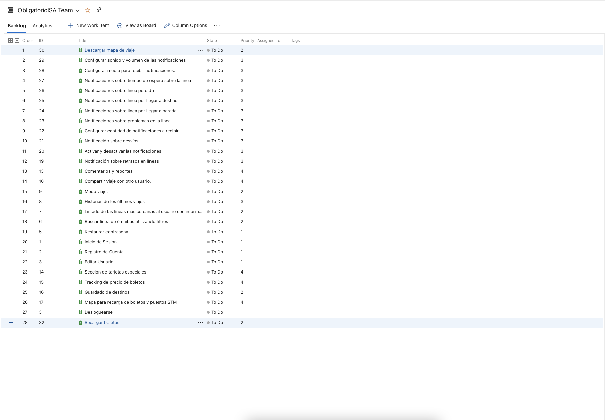

# Historia de Usuario y Criterios de Aceptacion

### Ejemplo:

# Reporte de horas

[Reporte de horas](https://docs.google.com/spreadsheets/d/1Kh862NqWlY94nU2gIDmNjZJNJ3PDnCxO8ejniM3c5-s/edit?usp=sharing)

    <h1 align="center">Sprint 2</h1>

## Objetivo del Sprint

Prototipado de diseños iniciales, para que el usuario pueda iniciar sesión en la aplicación.

## Sprint Planning

Tuvimos una meeting que duro alreadedor de 2:30 horas donde estuvimos hablando con Romi (Product owner)
con la cual decididimos cuales tareas eran las que aportaban mas valor, también creamos nuevas historias del feedback que
recibimos.
Luego sobre este set inicial de historias utilizamos Planning Poker para estimar las historias.

Para el Poker utilizamos https://www.scrumpoker-online.org.

Finalmente, dividimos las tareas entre el development team.

## Ejemplo Daily

Reflexión de la retro y oportunidades de mejora, descripción más detallada de los interesados, corrección del story map.
Tengo planeado terminar de documentar el análisis de resultado de entrevista, encuesta y funcionalidad por interesado. Tenia dudas sobre algunos análisis que habíamos realizado previamente para documentarlos correctamente pero se resolvieron en la daily.

[Dailies Sprint 2](Sprint2/Dailies.md)

## Validacion Prototipo con usuarios

### Contexto de las pruebas

Las pruebas se realizaron bajo el siguiente contexto:
- El usuario sabía que se trataba de un prototipo, que alunas funcionalidades no estaban implementadas y que por ejemplo no se pueden editar los textos de las casillas por el momento.
- Se probo en dispositivos soportados por la aplicación, aquellos que tienen formato Android Large.

### REVISIÓN 1: 27 años

- Flujo realizado por la persona:

La persona ingresó a la aplicación registrando, luego inicia sesión, en el mapa intenta seleccionar origen y destino, ve la pantalla del mapa, lo mueve, selecciona el botón de centrarse en la ubicación actual, se dirige a los botones en la parte inferior, empieza por el botón más a la izquierda pasando por todas las funcionalidades hasta el botón más a la derecha, vuelve al primer botón y examina el contenido y le da al botón editar, allí hace tap en las opciones de edición, al llegar a la fecha se despliega el calendario y e intenta seleccionar una fecha, debe realizar scroll para guardar los cambios. pasa al botón del centro donde se encuentra el mapa, realiza doble clic en el mapa, pasa al botón de perfil y selecciona cerrar sesión, selecciona el botón de iniciar sesión con google y termina la prueba.
 
- ¿Qué funcionalidades entiende que realiza? 

RE: “Tenés la opción de registrarse, iniciar sesión con usuario y sin usuario, podes ver un mapa con tu ubicación y seleccionar una línea de ómnibus, tenés una ventana para ver tu perfil y actualizarlo, además podés cerrar la sesión.”

- ¿Le parece que se cumplen? 

* Inicio de sesión, tanto en modalidad anónima como por google e iCloud y la funcionalidad de cerrar la sesión (Considera que se cumple)
* Permitir registrarse en la aplicación / crearse una cuenta que no sea con el correo de google (Considera que se cumple)
* Edición del perfil del usuario y sus datos (Considera que se cumple)
* Presentar la opción de un mapa con la ubicación actual del usuario y un vistazo de cómo se realizará la consulta para iniciar viajes ingresando origen y destino (Considera que se cumple, pero falta mejorar, como poder ingresar diferentes destinos)
* Mostrar la navegación que tendrá la app a todas las ventanas de la aplicación (Considera que se cumple)

- ¿Qué opina de los colores seleccionados, le pareció agradable a la vista? 

RE: “Los colores me parecen acertados, se ve tranquilo, se ven los textos y los iconos.”

- ¿Cómo le resultó la navegación? (registrar respuestas)

RE: “Siento que se entiende, me gusta que los botones no tengan texto, los iconos elegidos están bien, no se ve como la pantalla muy saturada. Se parece a aplicaciones que he utilizado antes.”

- ¿Tiene algo para comentar/agregar? (registrar respuestas)

RE: “Entiendo que este es un prototipo y no están todas las funcionalidades, las que están me parece que cumplen, pero después me interesaría ver más interacción, poder escribir mi nombre y apellido, poder ver el tiempo que me queda para tomar el bus de la línea que seleccione y en qué parada hacerlo.”

### REVISIÓN 2: 50 años

- Flujo realizado por la persona:

La persona inicia la aplicación ingresado con usuario anónimo, se le presenta el mapa centrado en su ubicación, selecciona el botón de modo viaje, al estar sin implementar regresa al botón de en medio, selecciona el icono de centrado en la ubicación realizando doble clic, intenta iniciar un viaje en la opción que se encuentra en la lupa en la parte superior de la ventana, aparece su viaje en pantalla y se desplaza por el siguiendo la trayectoria marcada, selecciona el botón de comentarios y luego pasa al botón de configuraciones, por ultimo selecciona el primer botón e intenta editar su perfil terminando la prueba.
 
- ¿Qué funcionalidades entiende que realiza? (registrar respuestas)

RE: “Podes ver en el mapa donde estas y armar un viaje con punto de partida y fin, podes tener datos, además tenés la opción de tener una cuenta.”

- ¿Le parece que se cumplen? (registrar respuestas)

* Inicio de sesión, tanto en modalidad anónima como por google e iCloud y la funcionalidad de cerrar la sesión (No lo probo)
* Permitir registrarse en la aplicación / crearse una cuenta que no sea con el correo de google (Considera que se cumple)
* Edición del perfil del usuario y sus datos (Considera que se cumple)
* Presentar la opción de un mapa con la ubicación actual del usuario y un vistazo de cómo se realizará la consulta para iniciar viajes ingresando origen y destino (Considera que se cumple)
* Mostrar la navegación que tendrá la app a todas las ventanas de la aplicación (Considera que se cumple)

- ¿Qué opina de los colores seleccionados, le pareció agradable a la vista?

RE: “Está lindo, me parece que los colores pegan bien y no son muy fuertes.”

- ¿Cómo le resultó la navegación? 

RE: “Entendí bastante bien, pero me faltaría algún texto para saber en que ventana estoy o que me marque con color.”

- ¿Tiene algo para comentar/agregar? 

RE: “No entendí mucho como se dónde están las paradas, me aparecieron datos de cuenta aunque entre de forma anónima, aparte de eso me gusta, si bien pienso que le falta texto, esta bueno que no sea mucho así las personas como yo que vemos menos podemos usarla sin tanto problema.”

### REVISIÓN 3: 20 años

- Flujo realizado por la persona:

La persona ingresó a la aplicación registrando al finalizar el registro se logeo, donde llego al mapa intento ir a configuraciones donde desactivo las notificaciones. Luego volvio al mapa, donde intento mover el mapa y volver a centrarlo. Comento que el mapa no se veia bien en cuanto a la resolución. Intento editar el usuario, no pudo cambiar la fecha. Pudo cerrar sesion y iniciar nuevamente. Al ir al mapa estuvo problemas al intentar iniciar un viaje, pero luego pudo iniciar el viaje correctamente. Bajo el mapa y finalmente fue a modo viaje donde noto que la pagina estaba vacia.
 
- ¿Qué funcionalidades entiende que realiza? 

RE: “Pude iniciar sesión, iniciar un viaje, cambiar la configuración de notificaciones, ver el mapa con la ubicación actual. También se puede editar el perfil de usuario y cerrar la sesión.”

- ¿Le parece que se cumplen? 

* Inicio de sesión tanto como por Google, iCloud y Usuario y Email, la funcionalidad se cumple. (Considera que se cumple, pero no noto la funcionalidad de anónimo)
* Permitir registrarse en la aplicación / crearse una cuenta que no sea con el correo de google (Considera que se cumple)
* Edición del perfil del usuario y sus datos (Considera que se cumple)
* Presentar la opción de un mapa con la ubicación actual del usuario y un vistazo de cómo se realizará la consulta para iniciar viajes ingresando origen y destino (Considera que se cumple parcialmente, tuvo problemas al elegir el origen y destino, y comentó que el mapa se ve mal)
* Mostrar la navegación que tendrá la app a todas las ventanas de la aplicación (Considera que se cumple)

- ¿Qué opina de los colores seleccionados, le pareció agradable a la vista? 

RE: “Los colores me parecen correctos, le dan una imagen minimalista a la aplicación”

- ¿Cómo le resultó la navegación? (registrar respuestas)

RE: “Sintió que algunas cosas estaban medio escondidas, y que otras no se entendia como realizarlas.”

- ¿Tiene algo para comentar/agregar? (registrar respuestas)

RE: “Dado que es un prototipo, me parece que está acertado, pero me hubiese gustado que se pueda escribir en los inputs y que algunas interacciones se cumplan.”

### REVISIÓN 4: 56 años

- Flujo realizado por la persona:

La persona fue a la sección de olvidó su contraseña realizando el camino completo, luego se registro y deslogueo. Posteriormente se logeo y seleccionó distintas secciones de la barra de navegación y por último realizó el flujo de iniciar viaje, seleccionando ubicación actual y destino. También descargo el mapa y compartió el viaje.
 
- ¿Qué funcionalidades entiende que realiza? 

RE: "Recuperar contraseña, registrarse, iniciar sesión, cerrar sesión, editar perfil, ver historial de viaje, ver mapa, iniciar viaje, compartir viaje, descargar mapa."

- ¿Le parece que se cumplen? 

RE: "Si, se cumplen todas las funcionalidades."

- ¿Qué opina de los colores seleccionados, le pareció agradable a la vista?

RE: "Si, los colores son adecuados y no son para nada molestos."

- ¿Cómo le resultó la navegación? (registrar respuestas)

RE: "La navegación me parecio un poco complicada al principio, pero después de un rato me acostumbre."

- ¿Tiene algo para comentar/agregar? (registrar respuestas)

RE: "Algunas notificaciones se mostraban contra el borde de la pantalla, lo que dificultaba su lectura."

[Validacion Usuarios](Sprint2/assets/validacion%20usuario.MP4)
## Prototipos

### Inicio 
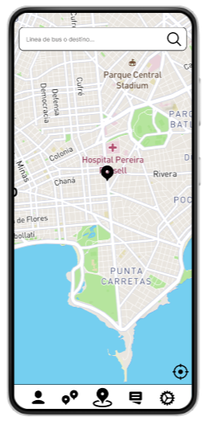

### Inicio Sesión 
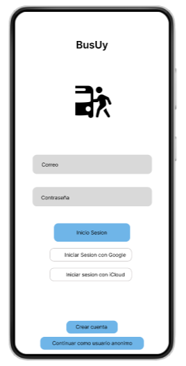

### Registro de la cuenta
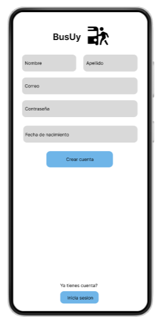

### Registro de la cuenta - selección de fecha

### Perfil 
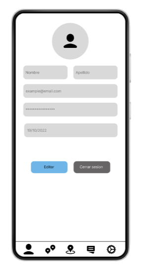

### Perfil - edición

### Perfil - selección de fecha

### Inicio Viaje

### Inicio Viaje - selección de destino

### Inicio Viaje - selección de líneas

### Inicio Viaje - seleccionar origen
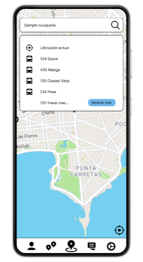

### Inicio Viaje - descarga de mapa
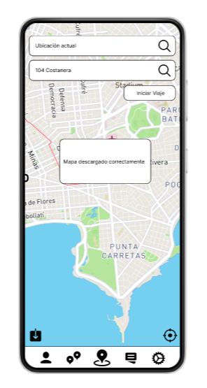

### Inicio Viaje - ruta seleccionada 

### Setting  

### Setting - lista de medios de notificación

### Setting  - desactivar notificacion

### Setting - desactivar sonido
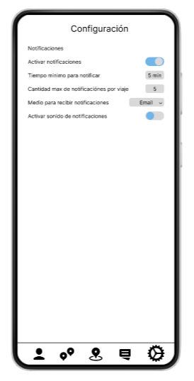

### Modo Viaje
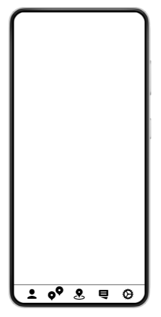

### Comentarios

### Link a prototipo

[Prototipo](https://www.figma.com/proto/HmnWSlpF0ozOWEV7KaNNtx/ISA-1?node-id=1%3A13&scaling=scale-down&page-id=0%3A1&starting-point-node-id=47%3A46)
## Sprint Review

Nos juntamos con el Product Owner para hacer la review.

En esta meeting revisamos las historias de usuarios realizadas, nos fijamos que se hayan completado cada una y que se cumplan los criterios de aceptacion y el DoD. Hicimos una demo de los prototipos realizados en esta iteración.
Romi nos dejo su feedback de algunas cosas, como por ejemplo que el mapa se veia con poca calidad en el celular, inicio de usuario como anonimo te deja deslogearte aunque nunca iniciaste sesión y las configuraciones le falta interacciones.

Dado el feedback creamos algunas historias de usuario para la proxima iteración.

## Retrospective

Utilizamos metroretro para hacer la retrospective.

Action Items:

- Fijar reuniones en un horario que nos permita estar todos a tiempo (Después de las 18hs)
- Tener mas de 3 usuarios para testear
- Tener al menos 2 code reviews realizados por developer

### Burn Charts

- Análisis:
Los burndown charts permiten visualizar rápidamente el trabajo pendiente. En el eje horizontal (eje x) se muestra el tiempo que queda para completar el proyecto en días, mientras que en el eje vertical (eje y) se muestran el esfuerzo restante necesario para completar el proyecto issues.
Vemos según el gráfico presentado que el equipo logra alcanzar los objetivos de la iteración pero no logra mantener una velocidad constante durante la iteración.

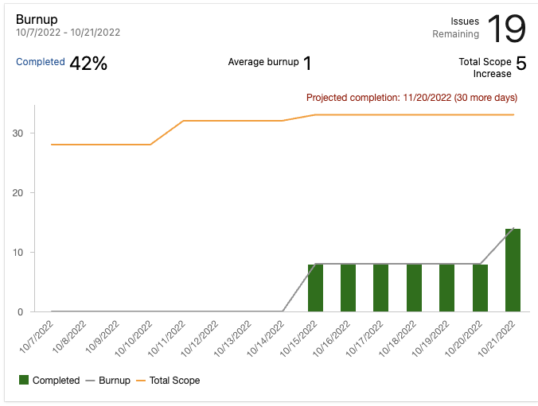

- Análisis:
El burnup chart permite visualizar el alcance de un proyecto o iteración y el trabajo realizado hasta el momento. En el eje horizontal (eje x) se muestra el tiempo transcurrido del proyecto en días, mientras que en el eje vertical (eje y) se muestran las unidades de trabajo por story points.
Como vemos en este gráfico hasta el momento se ha completado el 42% del trabajo establecido, las implementaciones se realizaron en la segunda mitad del sprint 2, ya que inicialmente se analizó que historias de usuario implementar y se pensó en el diseño de la aplicación en general. 

### Velocidad de equipo

Como se puede ver en la foto adjunta, el equipo tuvo una velocidad de 14 puntos. Como fue la primera vez que se midio
no se tiene comparacion con sprints anteriores.

# Reporte de horas

[Reporte de horas](https://docs.google.com/spreadsheets/d/1Kh862NqWlY94nU2gIDmNjZJNJ3PDnCxO8ejniM3c5-s/edit?usp=sharing)

    <h1 align="center">Sprint 3</h1>

## Objetivo del Sprint

Prototipado de diseños, principalmente modo viaje y notificaciones.

## Sprint Planning

Tuvimos una meeting que duro alreadedor de 3:00 horas donde estuvimos hablando con Romi (Product owner)
con la cual decididimos cuales tareas eran las que aportaban mas valor, también creamos nuevas historias del feedback que
recibimos. Agregamos las fotos que faltaban y descripciones que no se encontraban o que necesitaban mejorar.

Luego sobre las historias utilizamos Planning Poker para estimar las historias. Discutimos algunas, comparando con las historias que ya
habiamos hecho en el sprint anterior, llegando asi a acuerdos sobre la estimación.

Para el Poker utilizamos https://www.scrumpoker-online.org.

Finalmente, dividimos las tareas entre el development team.

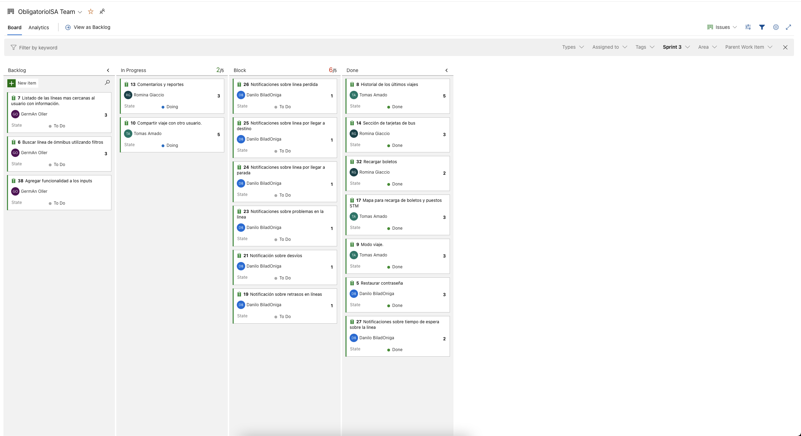

## Ejemplo Daily

Trabaje sobre prototipado en las historias asignadas. Sobre todo en modo viaje debido a que bloquea otras historias de usuario.

[Dailies Sprint 3](Sprint3/Dailies.md)

## Validacion Prototipo con usuarios

### Contexto de las pruebas

Las pruebas se realizaron bajo el siguiente contexto:
- El usuario sabía que se trataba de un prototipo, que alunas funcionalidades no estaban implementadas y que por ejemplo no se pueden editar los textos de las casillas por el momento.
- Se probo en dispositivos soportados por la aplicación, aquellos que tienen formato Android Large.

### REVISIÓN 1: 20 años

- Flujo realizado por la persona:

La persona ingresó a la aplicación registrando al finalizar el registro se logeo, donde llego al mapa intento ir a configuraciones donde desactivo las notificaciones. Luego volvio al mapa, donde intento mover el mapa y volver a centrarlo. Editó su usuario. Pudo cerrar sesion y iniciar nuevamente. Al ir al mapa inicio un viaje, al iniciarlo fue redirijido al modo viaje, donde noto cada parada en la ruta establecida y asimismo el destino final, el origen y la posición actual de la linea. 
Al iniciar el viaje le llego una notificacion de el tiempo de demora de la linea a su parada. Tambien noto que ahora habia un boton que centraba el mapa en la linea de bus y otro para compartir el viaje actual. Comento que el boton del bus deberia resaltar un poco más. Luego de eso intento compartir el viaje, lo cual lo pudo hacer sin problema. Al finalizar, fue a la pagina de "Mis Tarjetas" donde fue sorprendido por la información que mostabamos, indicó que esto es algo que las aplicaciones acutales no tienen y suma mucho ya que evita problemas al momento de quedarse sin boletos. Logro comprar mas boletos pero si noto que el saldo esta en pesos pero al cargar preguntaba en cantidad de boletos a cargar y que asimismo no sabia que tipo de boleto estaba cargando. Tambien noto que se puede observar los puestos de recarga cercanos. Volvio a configuraciones, donde noto que ahora existe la opcion de dejar un comentario sobre la app, el cual probo y noto que funciona muy bien. Luego, fue a su perfil y pudo observar el historial de viajes y guardar un viaje como favorito. Finalmente cerro sesion, y probó restaurar contraseña.
 
- Respecto a la version anterior nota alguna diferencia positiva? 

RE: “Definitivamente, mejoraron un monton las funcionalidades de la vez pasada y asimismo agregaron muchas nuevas que a mi parecer le suman mucho a la aplicacion, como por ejemplo el saldo actual del usuario”

- ¿Encontro algo que se pueda mejorar?

RE: "Si, hay algunas faltas ortograficas y el saldo al cargar muestra en cantidad de boletos en vez de monto."

- ¿Finalmente, como siente la aplicación en cuanto a usabilidad y curva de aprendizaje?

RE: "La verdad me parece bastante intuitiva, los iconos usados son faciles de entender. Cada seccion está bien definida. Los colores remarcan bien cada seccion e icono, y en cuanto a aprendizaje me parece que esta bastante buena y facil de usar, creo que sería una buena aplicación tanto como para jovenes como yo, como para adultos mayores."

### REVISIÓN 2: 55 años

- Flujo realizado por la persona:

La persona ingresó a la aplicación iniciado sesion directamente. Llego al mapa y comenzó un viaje, seleccionando el origen y el destino, noto que ahora se mostraba mas información sobre cada linea. Al llegar al ultimo paso noto la ruta y sus paradas asi como la ubicacion actual de la linea mas cercana a ella. Al iniciar el viaje recibio una notificacion sobre la linea proxima a llegar y su tiempo, también noto que ahora podia compartir el viaje y centrar el mapa en el bus. Fue a configuraciones donde desactivo las notificaciones y dejo un comentario sobre la aplicacion. Luego volvio al mapa, donde intento mover el mapa y volver a centrarlo y pudo notar el tiempo para llegar al destino. Editó su usuario. Pudo cerrar sesion y iniciar nuevamente, donde se dio cuenta que se podria restaurar su contraseña. Al iniciar sesion nuevamente, fue a la pagina de "Mis Tarjetas" donde fue sorprendida por la información que mostabamos, indicó que esto es algo que le interesa mucho ya que le ha pasado de olvidarse de cargar y subirse a alguna linea sin tener saldo o efectivo. Logro comprar mas boletos pero si noto que el saldo esta en pesos pero al cargar preguntaba en cantidad de boletos a cargar y que asimismo no sabia que tipo de boleto estaba cargando. Tambien noto que se puede observar los puestos de recarga cercanos. Finalmente, fue a su perfil para cerrar sesion y pudo observar el historial de viajes y guardar un viaje como favorito. Finalmente cerro sesion.
 
- Respecto a la version anterior nota alguna diferencia positiva? 

RE: “Si, mejoraron los errores de la version pasada y agregaron algunas nuevas que estan muy buenas.”

- ¿Encontro algo que se pueda mejorar?

RE: "Si, algunos botones son demasiado chicos o resaltan poco, podrian agrandarlos un poco más. La barra de navegacion no se ve bien en mi celular."

- ¿Finalmente, como siente la aplicación en cuanto a usabilidad y curva de aprendizaje?

RE: "Me parece bastante intuitiva, los iconos de cada tab son faciles de entender. Muy buenos los colores, remarcan bien cada seccion e icono. En cuanto al aprendizaje me parece que esta bastante buena, puede que al principio demore un poco en aprenderla debio a que estoy acostumbrada a Moovit, pero debido a las funcionalidades creo que me acostumbraria rapidamente."

### REVISIÓN 3: 23 años

- Flujo realizado por la persona:

El usuario realizó las siguientes acciones por pantalla:
Crear cuenta, apretó el botón de crear cuenta
En pantalla de mapa buscar una línea, movió el mapa y vio la línea de bus
Cargar boletos, ver puntos de carga, volver, comprar boletos
Configuraciones, cambiar notificaciones, cambiar el medio de las notificaciones, enviar comentarios
Perfil, vio historial de viajes apretó ver viajes favoritos
Luego apretó el botón de dos gps, y compartí mi viaje

¿Qué funcionalidades entiende que realiza?
RE: “Considero que cuenta con Inicio de sesión, Registro, Mapa de bus y linea, Cargar boletos, Ver configuraciones, cambiar notificaciones y medio de notificaciones. Hacer reportes de la app, Editar mi usuario, ver líneas favoritas, ver historial de viajes y Compartir viaje que estoy haciendo.”
 
¿Le parece que se cumplen?
- Inicio de sesión tanto como por Google, iCloud y Usuario y Email, la funcionalidad se cumple. (Considera que se cumple)
- Permitir registrarse en la aplicación / crearse una cuenta que no sea con el correo de google (Considera que se cumple)
- Edición del perfil del usuario y sus datos (Considera que se cumple)
- Presentar la opción de un mapa con la ubicación actual del usuario y un vistazo de cómo se realizará la consulta para iniciar viajes ingresando origen y destino (Considera que se cumple)
- Mostrar la navegación que tendrá la app a todas las ventanas de la aplicación (Considera que se cumple)
- Notificaciones al usuario (Considera que se cumple)
- Posibilidad de compartir un viaje con otra persona (Considera que se cumple)
- Permitir comentarios/reportes dentro de la aplicación (Considera que se cumple)
- Presenta modo viaje (Considera que se cumple)
- Posee historial de viajes realizados (Considera que se cumple)
- Se muestran las líneas más cercanas al usuario con información de tiempo espera/pasajeros (No lo comenta)
- Permite restaurar una contraseña (No lo experimenta)
- Posee sección de tarjeta de bus con información y posibilidad de compra (Considera que se cumple)

- ¿Qué opina de los colores seleccionados, le pareció agradable a la vista?
RE: Si, no son colores muy invasivos, esta bueno

- ¿Cómo le resultó la navegación? 
RE: Muy intuitiva con los botones de iconos que está claro que hace cada uno

- ¿Qué tan intuitivo le pareció, le causó dificultad comprender alguna funcionalidad? 
RE: No, se hace muy claro y navegar es muy fácil

- ¿Tiene algo para comentar/agregar?¿Encontró algo que se pueda mejorar? 
RE: Estaria bueno que en el perfil también pueda ver las tarjetas asociadas a mi cuenta

- ¿Finalmente, cómo se siente la aplicación en cuanto a usabilidad?
RE: Muy buena, se hace intuitiva

### REVISIÓN 4: 27 años

- Flujo realizado por la persona:

El usuario ingresa iniciando sesión como anónimo, luego va al icono del perfil, allí ve un nuevo botón "Historial de viajes", en la pantalla de historial decide apretar el botón “Guardar como favorito”, se le aparece el mensaje en pantalla de éxito en la acción, el usuario lo cierra apretando la cruz rápidamente, cerrando de igual forma el historial de viajes. Después se dirige al siguiente botón allí selecciona el icono del autobús que le muestra en el mapa la ubicación del ómnibus, apreta el botón de centrar en la ubicación actual y selecciona el botón de descargar mapa apareciendo la notificación correspondiente y desapareciendo al cabo de unos segundos. Pasa al botón de inicio de viaje en el cual se muestra el mapa y se solicita ingresar origen y destino, abre la selección de destinos y selecciona “mostrar mas” y luego “filtrar”, selecciona la línea “104” y verifica con la mirada el resultado, selecciona el botón “mostrar menos” y elige la primer opción de la lista. Pasa a seleccionar el origen del viaje haciendo un recorrido similar al anterior, selecciona el botón “Mostrar más”, selecciona el primer elemento de la lista y le aparece la notificación del tiempo restante para que el bus pase por su parada. Pasa al botón de tarjetas, lee el detalle y selecciona “Recargar boletos”, observa los precios y selecciona el botón “Comprar boletos”, revisa los datos a insertar y le da a “Comprar”, se mueve a la sección de settings e ingresa en enviar comentarios, termina la prueba.

- Respecto a la versión anterior nota alguna diferencia positiva? 

RE: “Si veo que ahora la aplicación tiene muchas más funcionalidades y se me hace más interactiva, es amigable de utilizar y entendible.”

¿Le parece que se cumplen las funcionalidades agregadas?
- Notificaciones al usuario (Considera que se cumple)
- Posibilidad de compartir un viaje con otra persona (No lo experimenta)
- Permitir comentarios/reportes dentro de la aplicación (Considera que se cumple)
- Presenta modo viaje (Considera que se cumple)
- Posee historial de viajes realizados (Considera que se cumple)
- Se muestran las líneas más cercanas al usuario con información de tiempo espera/pasajeros (Considera que se cumple)
- Permite restaurar una contraseña (No lo experimenta)
- Posee sección de tarjeta de bus con información y posibilidad de compra (Considera que se cumple)

- ¿Encontró algo que se pueda mejorar?

RE: "Ahora mismo veo que la aplicación está mucho más completa, tal vez estaría bueno poder seleccionar un viaje favorito, que me muestre los detalles y que me lo tome directamente como nuevo viaje."

- ¿Finalmente, cómo se siente la aplicación en cuanto a usabilidad y curva de aprendizaje?

RE: "Se siente interactiva y un poco también personalizable gracias a los settings y la posibilidad de tener viajes favoritos."

### REVISIÓN 5: 50 años

- Flujo realizado por la persona:

En el inicio de sesión selecciona la opción “olvidó su contraseña?” le da click en continuar hasta el login y luego inicia sesión. Selecciona en la barra  de búsqueda “línea de bus o destino”, comenta que le agrada como se indica el tiempo de espera y la cantidad de personas de los vehículos, selecciona la opción de 104 costanera y como origen la ubicación actual. Se mueve al modo viaje y allí revisa las nuevas interacciones del mapa, descarga el mapa y luego lo comparte por mail, visualiza la notificación del envío. Pasa a la sección de “Mis tarjetas” y selecciona “Recargar boletos”, revisa las acciones de comprar boleto y ver el mapa de puntos de recarga. Pasa a la sección de “Configuraciones” y decide enviar un comentario seleccionando “Enviar comentario o reporte de incidente”, selecciona el tablero para introducir el mensaje y luego le da a “Enviar”, revisa el comentario y vuelve al mapa principal para terminar la prueba.

- Respecto a la versión anterior nota alguna diferencia positiva? 

RE: “Se tiene interacciones en todas las pantallas, además las acciones que se permiten son útiles y se entienden bastante bien”

¿Le parece que se cumplen las funcionalidades agregadas?
- Notificaciones al usuario (Falta en el caso de recuperación de contraseña.)
- Posibilidad de compartir un viaje con otra persona (Considera que se cumple)
- Permitir comentarios/reportes dentro de la aplicación  (Considera que se cumple)
- Presenta modo viaje  (Considera que se cumple)
- Posee historial de viajes realizados (No lo experimenta)
- Se muestran las líneas más cercanas al usuario con información de tiempo espera/pasajeros  (Considera que se cumple)
- Permite restaurar una contraseña  (Considera que se cumple)
- Posee sección de tarjeta de bus con información y posibilidad de compra  (Considera que se cumple)

- ¿Encontró algo que se pueda mejorar?

RE: "En la parte de recuperar contraseña me gustaría ver alguna confirmación de que mi contraseña quedó actualizada. Me gustaría seguir viendo el tiempo de espera del ómnibus una vez que seleccione origen y destino, no solo para seleccionarlo."

- ¿Finalmente, cómo se siente la aplicación en cuanto a usabilidad y curva de aprendizaje?

RE: "Se siente más fluida que la vez anterior y tiene más vida porque existen más interacciones,"

### REVISIÓN: REFLEXIÓN

En estas pruebas los usuarios sugirieron los siguientes ajustes:

- Agregar la posibilidad de ver los detalles de los viajes favoritos, esto se incluyo en el sprint actual.
- Agregar la posibilidad de visualizar el tiempo de espera una vez seleccionado el origen y destino para el sprint 4.
- Un usuario considero que algunos botones son demasiado chicos o resaltan poco, esto se ajusto en el sprint actual.
- Existia un error en el cual el saldo al cargar mostraba en cantidad de boletos en vez de monto, esto fue ajustado en el sprint actual.

## Prototipos

### Inicio session
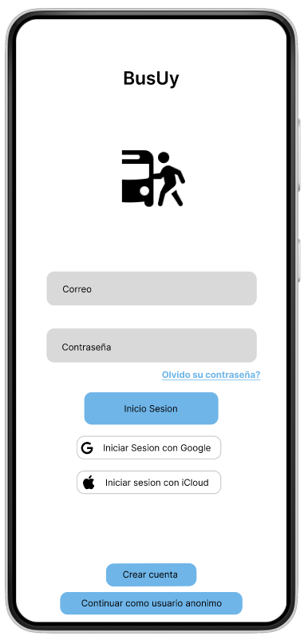

### Recuperacion Contraseña

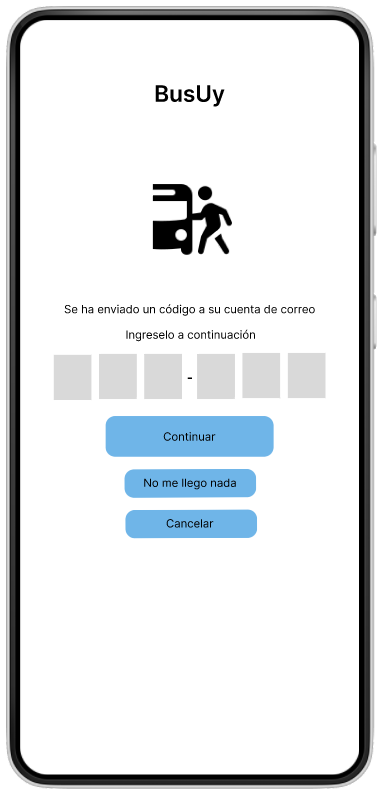
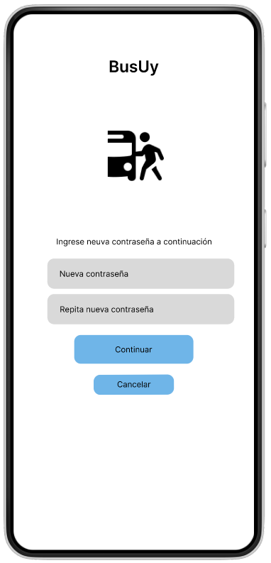

### Registrar Cuenta

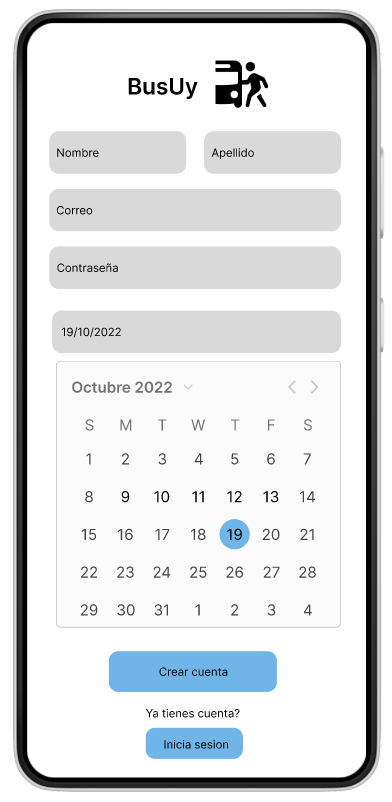

### Sección Inicio Viaje

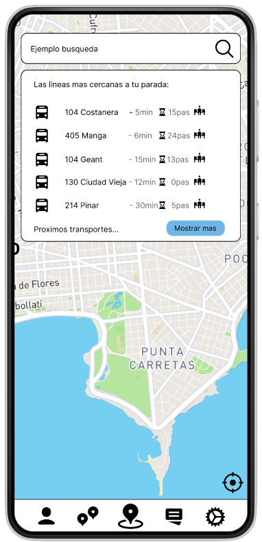

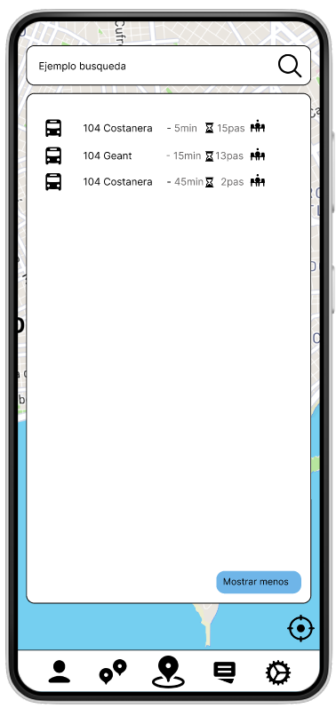
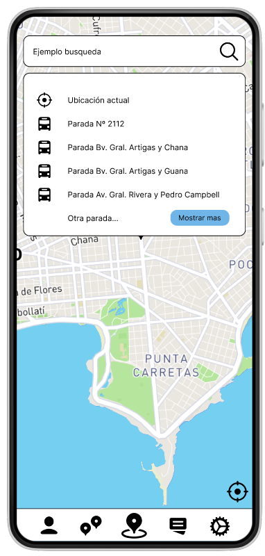

### Sección Modo Viaje

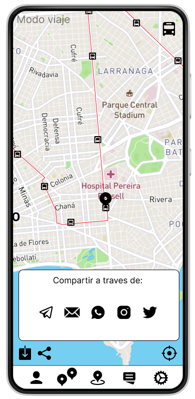

### Sección Perfil

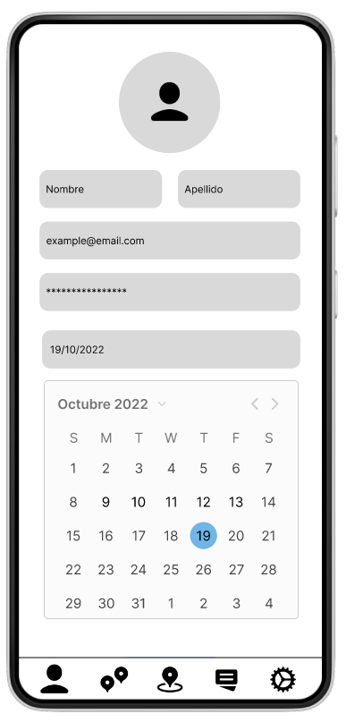

### Historial Viaje

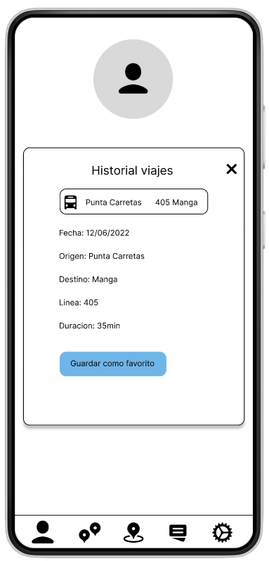

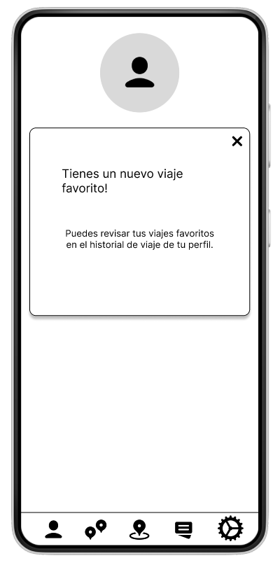

### Sección Tarjetas STM

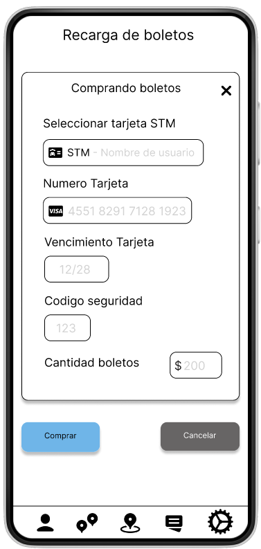

### Sección Configuración
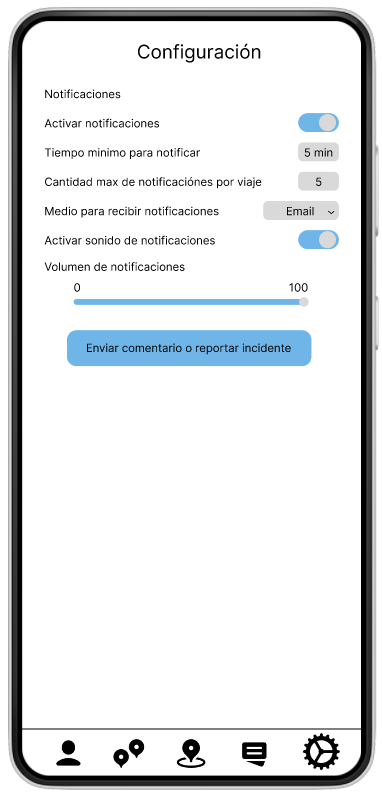

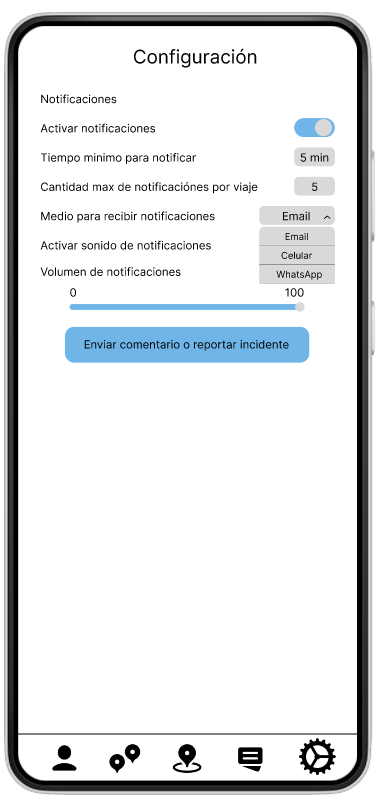

### Sección Comentarios

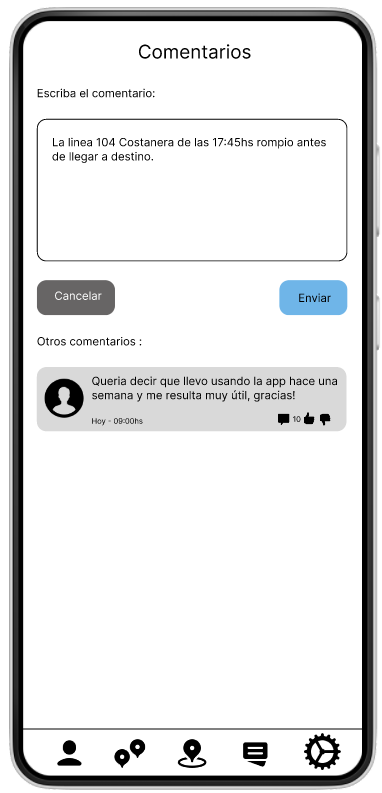

### Notificaciones
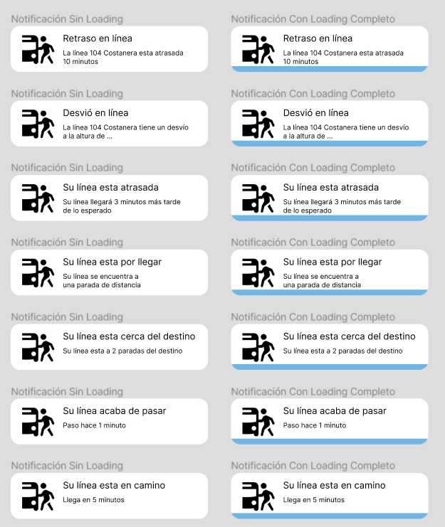

### Link a prototipo

[Prototipo](https://www.figma.com/proto/HmnWSlpF0ozOWEV7KaNNtx/ISA-1?node-id=1%3A13&scaling=scale-down&page-id=0%3A1&starting-point-node-id=47%3A46)
## Sprint Review

Nos juntamos con el Product Owner nuevamente para hacer la review.

En esta meeting revisamos las historias de usuarios realizadas, nos fijamos que se hayan completado cada una, asi también revisamos el feedback dado en la iteración anterior. Revisamos también que se cumplan los criterios de aceptacion y el DoD.
Hicimos una demo de los prototipos realizados en esta iteración. El PO quedo muy contento sobre el trabajo realizado y que logramos cumplir las metas.

## Retrospective

Utilizamos metroretro para hacer la retrospective.

Action Items:

- Mejorar las faltas de ortografía. Tanto en el readme como en la aplicación verificar que se corrían las faltas que pasamos por alto.

Action Items anteriores:

Consideramos que se cumplieron los Action items de la retrospective del Sprint 2 ya que:

- Fijamos los horarios para reuniones a partir de las 18hs
- Obtuvimos pruebas de usuario para más de 3 personas, en este caso 5
- Los Pull Request realizados fueron revisados por al menos dos integrantes del equipo

### Burn Charts

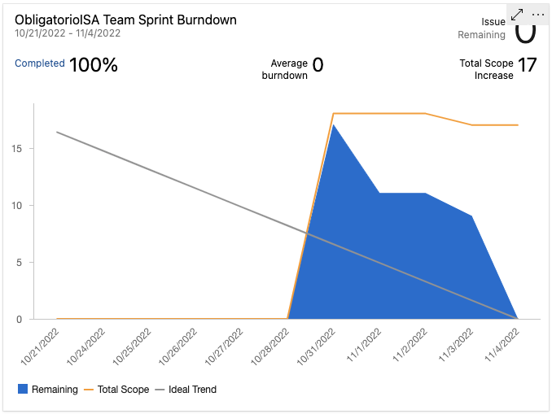

Al analizar el grafico, podemos ver un delay a la hora de agregar y realizar las tareas. A partir del 28/10 se agregaron todas. Luego se fueron realizando hasta quedar sin pendientes. A excepcion de "Agregar funcionalidad a los inputs" que se opto por descartar, ya que representaba una gran dificultad y era poco util. La realizacion de las tareas no tomo el camino optimo, dado que hubo una desaseleracion en la velocidad del trabajo y para coompensar eso se empezo a trabajar mas rapido hacia el final, como se puede ver en el cambio de tendencia en la grafica. 

### Velocidad de equipo

Como se puede ver en la foto adjunta, el equipo tuvo una velocidad de 17 puntos. Comparado con el sprint anterior
se puede ver que el equipo trabajó más, mayor cantidad de puntos, por lo cual se puede llegar a la conclusion que 
el sprint anterior el equipo se estaba ajustando a las herramientas y por lo tanto se hicieron menos puntos.

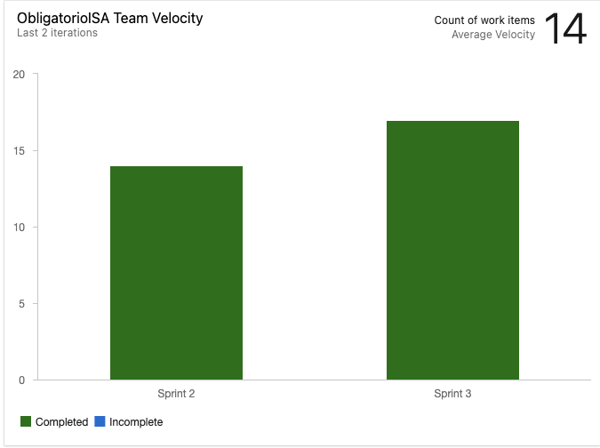

# Reporte de horas

[Reporte de horas](https://docs.google.com/spreadsheets/d/1Kh862NqWlY94nU2gIDmNjZJNJ3PDnCxO8ejniM3c5-s/edit?usp=sharing)

    <h1 align="center">Sprint 4</h1>

# Objetivo del sprint

# Link a video del canal de webstream

Debe existir un video (de 6 minutos máximo) demostrando el
flujo principal de los prototipos, explicando el problema que
se quiere resolver y el valor entregado por el producto
ideado
https://web.microsoftstream.com/channel/d34a87ad-2ab5-4e03-88b6-a14c8cbbf24e

# Analisis del video

El video deberá ser publicado en el canal de
webstream del curso y enlazado en el informe académico
para su correcta visualización

# Resumen del trabajo 

Resumen del trabajo y de los resultados

# Reflexiones 

lecciones aprendidas
sobre las prácticas de ingeniería de software ágil

# Reporte de horas