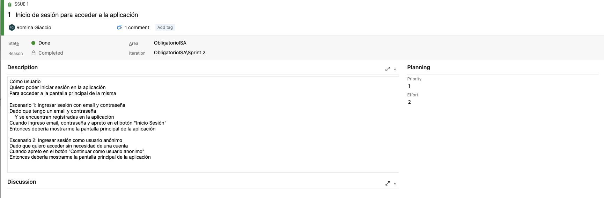

## Eventos SCRUM

Sprint Planning - Primer Viernes despues del comienzo del Sprint alrededor de 17:30.

El Sprint Planning es una reunión que se realiza al comienzo de cada Sprint donde participa
el equipo Scrum al completo; sirve para inspeccionar el Product Backlog y que el equipo de 
desarrollo seleccione las historias de usuario en los que va a trabajar durante el siguiente Sprint.
Estas historias son los que compondrán el Sprint Backlog.

Daily - Lunes, Miercoles y Viernes por Whatsapp a las 13:00.

La Daily es una reunión recurrente de aproximadamente 15 minutos en la que participa exclusivamente el Development Team.

En esta reunión todas y cada una de las personas del Development Team responden a las siguientes preguntas:

¿Qué hice ayer para contribuir al Sprint Goal?
¿Qué voy a hacer hoy para contribuir al Sprint Goal?
¿Tengo algún impedimento que me impida entregar?

Sprint Review - El dia antes a la entrega. (Sabado o Domingo)

La Sprint Review es una reunión en la cual el Development team muestra al Product Owner el incremento realizado en el sprint actual
y el Product Owner puede dar feedback sobre las tareas realizadas.

Esta reunion ocurre al final del Sprint y antes de la retrospective.

Sprint Retrospective - El dia antes a la entrega. (Sabado o Domingo).
Utilizaremos [Metroretro](https://metroretro.io/) como herramienta para las restrospectivas.

La Sprint Retrospective es una reunión en la cual el Development team analiza su actuación y desempeño durante el Sprint
en busca de mejorar para el proximo Sprint. 

En esta generalmente se utilizan herramientas como Metroretro que le permiten al equipo participar de forma anonima
y poder compartir las diferentes opiniones sobre los resultados y/o problemas que tuvieron en el Sprint.

Esta reunion ocurre al final del Sprint generalmente sucede después de la Sprint Review.

## Roles

- Scrum Master - Tomas
    El rol incluye liderar al equipo en el marco de SCRUM, 
    permitiendo mejorar la agilidad del mismo para una entrega de mejor valor al cliente.

    Este debe la responsabilidad de que se sigan las practicas de SCRUM y sus principios.

- Product Owner - Romina
    El rol incluye encargarse de crear las historias de usuario junto al eqquipo de desarrollo,
    aclarar dudas respecto al producto y que historia brinda valor.

    Tambien este se encarga de priorizar el Product Backlog para poder tomar las historias para
    las siguientes iteraciones, y que estas brinden el mayor valor posible.

    Tambien se encarga, no unicamente, de validar que estas historias esten completas y que el
    objetivo del sprint se haya cumplido, esto sucede en la Sprint Review.

- Development Team - Todos
    Encargados de toda la parte que sea desarrollo y asimismo tambien participaran de los eventos
    de SCRUM.

## Estategias de branching

Utilizaremos GitFlow como estrategia de branching con un leve cambio, agregamos un nuevo tipo de rama llamada <strong>bug/X</strong> para diferenciar los bugs de los hotfixes.

- Main - Rama principal.

- Dev - Rama de desarollo. Esta sera la rama donde se mergeara los cambios realizados para cada iteracion.

- feature/X - Feature sobre historia X a desarollar.

- hotfix/X - Hotfix sobre historia X ya desarollada.

- bug/X - Fix de bug sobre historia X.

## Estategias de Pull request

Seguiremos la siguiente estrategia para los pull requests, y al final de cada sprint se creara un pull request de <strong>dev</strong> a <strong>main</strong> para pushear los cambios realizados sobre la iteracion.

- feature/X - Feature sobre historia X a desarrollar.

- hotfix/X - Hotfix sobre historia X ya desarrollada.

- bug/X - Fix de bug sobre historia X.

## Politicas de Trabajo

### Definition of Ready

Consideraremos que una Historia de Usuario estará lista para desarrollarese cuando cumpla con el criterio INVEST: Independiente, Negociable, Valiosa, Estimable, Corta (Short) y Testeable.

Es decir, para que una Historia de Usuario sera incluida en el siguiente Sprint por el equipo de desarrollo debe presentar las siguientes características:

- Independiente: no tendrá dependencias con otras historias que pudieran impedir su desarrollo. Por tanto, si para que la funcionalidad A sea posible es necesario tener la B, entonces la historia A no es independiente.

- Negociable: debe permitir espacio para la discusión con el Product Owner.

- Valiosa: debe aportar valor al cliente. Cumpliendo este criterio evitas desarrollar algo inútil.

- Estimable: puede ser estimada por el DevTeam (en tamaño relativo, en puntos de historia, etc).

- Corta: debe poder terminarse durante el Sprint. Si se encuentra una Historia demasiado grande, eso exige al Product Owner que la subdivida en varias Historias más pequeñas.

- Testeable: la Historia en su descripción debe contar con la información suficiente como para poder ser probada.

### Definition of Done

Consideraremos que una Historia de Usuario estará terminada cuando cumpla con las siguientes caracteristicas:

- Existencia de prototipo sobre la Historia de Usuario.

- Review sobre los cambios realizados por al menos 2 reviewers.

- Documentacion actualizada sobre los cambios realizados.

# Sprint 1

## Objetivo del Sprint

Identificar el problema y definir una solucion al mismo.

## Sprint Planning

Definimos que tareas teniamos que hacer, entrevistas, encuestas, etc. Nos dividimos algunas tareas.
Definimos el marco de SCRUM y que eventos y roles vamos a seguir y/o tomar.

## Dailies

### Daily 26-09-2022

- Romi: Hice la investigación de la aplicación de STM, creo que lo que faltaría es ver que mejoras a partir de los pros que encontré se pueden añadir a nuestro producto.
  No eh tenido problemas salvo para entender algunos aspectos de la aplicación que me tocó investigar, pero pude resolverlos. Tengo pendiente hacer el pull request.

- Danilo: Investigacion sobre las secciones de que provee la app "como ir", pros, cons. Voy a agregar algunas observaciones de la misma. No tengo ningun bloquer.

- German: Investigacion sobre la app que me habia tocado, pros, cons, requisitos. No tengo bloquer.

- Tomas: Investigacion sobre Moovit, pros, cons, requisitos, me junte con Romi para ver un poco como empezar el backlog pero no empezamos aun.

### Daily 4-10-2022

- Romi: Trabaje sobre el backlog creando historias de usuario y priorize el backlog. Story Map. Analisis de encuestas y entrevista. Reporte de horas. Retrospective y Review. Creacion de encuestas.

- Danilo: Trabaje sobre product backlog con el equipo. Story Map. Analisis de encuestas y entrevista. Reporte de horas. Retrospective y Review.

- German: Trabaje sobre product backlog con el equipo. Story Map. Analisis de encuestas y entrevista. Reporte de horas. Retrospective y Review.

- Tomas: Trabaje sobre product backlog con el equipo. Story Map. Analisis de encuestas y entrevista. Reporte de horas. Retrospective y Review.

## Sprint Review

Nos juntamos con el Product Owner para hacer la review.

En esta meeting revisamos el backlog con el PO y fuimos historia a historia hablando de cada una y discutiendo si estabamos de acuerdo entre todos, preguntando (Dev team) al PO sobre las historias para mas claridad sobre cada una.

Obtuvimos feedback y se agregaron nuevas historias de usuario que faltaban, entre ellas descargar el mapa y pago de boletos desde la app.

## Retrospective

Utilizamos metroretro para hacer la retrospective.

# Investigacion Moovit

### Cumple con los requisitos

- Tiene notificaciones
- No cuenta con login ni registro de usuarios
- Cuenta con busqueda pero no tiene filtros.
- Cuenta con mapa en vez de listado, de estaciones cercanas al usuario pero no dice cantidad de usuarios en la linea, solamente recorrido, hora de salida y llegada a destino.
- Posee historial de lineas recientemente usadas o vistas.
- Posee modo viaje.
- Se puede compartir los viajes con otros usuarios.

### Pros

- Usa localizacion en tiempo real.
- Se puede setear donde queda el domicilio del usuario.
- Se puede marcar como favoritas las lineas de bus que el usuario desee.
- Se puede reportar varias cosas:
  - La linea estaba llena y no se pudo subir.
  - La data de la aplicacion era incorrecta.
  - Estado del servicio.
- Se puede pedir un Uber desde la app.
- Se puede buscar por calle a donde se quiera ir, y la app sugiere lineas para llegar al destino.
- Posee modo oscuro y modo claro.
- La informacion es clara y concisa.
- La interfaz es comoda de usar y se entiende.
- Posee mapa lo cual ayuda a visualizar donde se encuentra el usuario y donde esta el destino.

### Cons

- Tiene ads requiere de version premium para poder removerlos.
- Al usar geolocalizacion puede que consuma mucha bateria y datos.
- No cuenta con mas informacion sobre el historial del usuario
- No se puede descargar como PDF los datos.
- No cuenta con traqueo de precios de las lineas.
- La lista de recientes indica todos los lugares que se propusieron como puntos de destino/origen/favoritos sin importar si se llavo a cabo el viaje.

### Observaciones

- Muy facil de usar.
- Intuitiva y facil de navegar
- Buen diseño

# Investigacion: STM

### Cumple con los requisitos

- No cuenta con: login, registro de usuarios o contrasenias
- Cuenta con filtros pero son solo de ida/vuelta y tipo de dias
- No contiene historial de viajes (Solo de omnibus tomados, como un filtro)
- No cuenta con modo viaje
- Se puede compartir el viaje en forma de screenshots y mediante otras aplicaciones de mensajeria instantanea mas utilizadas
- Esta disponible para android desde la aplicacion de PlayStore
- No cuenta con informacion de la cantidad de pasajeros en los vehiculos
- No cuenta con notificaciones del viaje

### Pros

- La primera vez que se abre la aplicacion contiene un pequeño tutorial.
- Se puede compartir como vinculo y por las principales aplicaciones de mensajeria.
- Muestra en el mapa ubicaciones de locales para descargar la tarjeta stm.
- Permite ver el saldo de la tarjeta (login en saldos y beneficios)
- Cuenta con bandeja de notificaciones donde se pueden avisos de horarios especiales, cambios de frecuencias, nuevas condiciones al presentar documentos para tarjetas especiales, desvios, lineas especiales, vigencia de boletos, etc.
- Se pueden deshabilitar las notificaciones
- Permite visualizar recorridos
- Permite enviar screenshots
- Permite configurar la primera patalla al iniciar la aplicacion
- Permite eliminar la publicidad
- Permite agregar paradas y muestra los horarios de omnibus que pasan por la misma
- Contiene informacion sobre posibles trasbordos (no muy detallado)
- Contiene una lista de lugares de interes (limitada pero complementaria a la lista de lugares favoritos)

### Cons

- El boton de seleccionar ida y vuelta no es intuitivo, podria parecer que solo se tiene una opcion.
- La informacion parece que se muestra en una pantalla gigante, no tiene indicaciones sobre como ver el contenido completo.
- No cuenta con la opcion para descargar como pdf o archivo de imagen.
- Para aplicar el tema dark, es necesario reiniciar la aplicacion
- Tiene una busqueda de lugares de interes pero estos son fijos (no puedes consultar lugares por nombre que no esten en el listado, si por esquina o numero)
- Indica tiempo de llegada al destino pero en una ventana que dura unos segundos abierta.
- La lista de recientes indica todos los lugares que se propusieron como puntos de destino/origen/favoritos sin importar si se llavo a cabo el viaje.

### Observaciones

- En general resulta poco intuitiva.
- Existen pantallas a las que es dificil retornar.
- Permite guardar las paradas que utiliza el usuario, si bien no es muy intuitiva, podria ser una buena opcion para una persona mayor que frecuenta siempre las mismas ubicaciones, si solo utiliza esta funcionalidad.
- Falta de funcionalidades importantes (seguimiento de viaje).
- La seleccion de origen - destino es complicada.

# Investigacion Como Ir

### Cumple con los requisitos

- No permite ingresar/registrarse con un usuario, del mismo modo no permite editar tu perfil o restaurar una contraseña
- Permite filtrar los omnibus por número y horario
- Permite acceder al listado de lineas con la información de origen/destino/tiempo estimado, pero no a la cantidad de pasajeros en las mismas
- Posee un historial de viajes
- Tiene modo viaje
- Permite compartir tu viaje a otro usuario
- No posee sistema de notificaciones acerca del viaje

### Pros

- Permite registrar targeta STM
- Se pueden seleccionar las ubicaciones en un mapa o escribir el origen y destino en campos de texto
- Tiene un sistema de notificaciones acerca de los precios y de las lineas de omnibus, por ejemplo acerca de paros, cambios de rutas, etc
- Permite una sección de favoritos para guardar tus ubicaciones para futuros viajes
- Permite ver tu ubicación en todo momento en un mapa interactivo

### Cons

- La interfaz es muy poco intuitiva, al momento de seleccionar si ir en bus o a pie desaparece las dos opciones, al menos que se vaya hacia atras, pero el menu principal sigue mostrando lo mismo
- No informa sobre los horarios de llegada de los omnibus
- No se permiten guardar los viajes hechos previamente, solo las ubicaciones

### Observaciones

# Investigacion: CityMapper

### Cumple con los requisitos

- Cuenta con login, inicio de sesión y contraseñas.
- Cuenta con filtros.
- No contiene historial de viajes (Solo de omnibus tomados, como un filtro)
- Cuenta con modo viaje
- Se puede compartir el viaje en forma de screenshots y mediante otras aplicaciones de mensajeria instantanea mas utilizadas
- Esta disponible para android desde la aplicacion de PlayStore
- No cuenta con informacion de la cantidad de pasajeros en los vehiculos
- Cuenta con notificaciones del viaje

### Pros

- La primera vez que se abre la ni siquiera requiere tutorial porque es muy intuitiva.
- Es internacionalmente conocida.
- Esta muy optimizada, corre sin trancazos y con muy linda interfaz gráfica.
- Se puede compartir como vinculo y por las principales aplicaciones de mensajeria.
- Muestra en el mapa ubicaciones de interes y lugares de gran concurrencia
- Se pueden deshabilitar las notificaciones
- Permite visualizar recorridos
- Permite enviar screenshots
- Permite configurar la primera patalla al iniciar la aplicacion
- Permite eliminar la publicidad (opcion paga).
- Contiene una lista de lugares de interes (limitada pero complementaria a la lista de lugares favoritos)
- Permite ver opciones para varios medios de transporte como tren, metro bus, bicicleta, caminata, MetroBus, etc.
- Permite guardar la ubicacion de un hogar para acceder a rutas facilmente. Tambien permit agregar la ubicacion del trabajo y otros sitios de gran relevancia.
- Permite monitorear el ahorro de CO2, calorias quemadas y el dinero ahorrado.

### Cons

- La opcion de pago es muy costosa.
- No tiene nocion de rutas peligrosas.
- Todavia no llego al mercado nacional.
- No cuenta con la opcion para descargar como pdf o archivo de imagen.
- No tiene tema dark.

### Observaciones

- Es muy intuitiva.
- Es rapida.
- Es facil aprender a usarla y hacerse un usuario.
- De presentarse al mercado nacional va a ser un competidor voraz.

# Entrevistas

### Preguntas 
- 1 ¿Conoces alguna aplicación para viajar en ómnibus?
- 2 ¿Usas alguna aplicación para ver tu viaje en ómnibus? 
- 3 ¿Qué ventajas ves en esta?
- 4 ¿Qué desventajas ves en esta?
- 5 ¿Cuales son las funcionalidades más importantes que debería tener
- 6 ¿Te gustaría poder iniciar sesión con google o permanecer anónimo?
- 7 ¿Le gustaría que la aplicación permitiera compartir la ubicación de su viaje en tiempo real?
- 8 ¿Le gustaría que la aplicación tuviera destinos guardados/preferidos?
- 9 ¿Te interesaría que la aplicación permitiera ver en el mapa los puestos de recarga de boletos?
- 10 ¿Te interesaría poder enviar comentarios dentro de la aplicación? (Quejas, sugerencias o comentarios en general)
- 11 ¿Te interesaría que la aplicación tuviera una sección en la cual indique el 
- 12 ¿Se te dificulta el uso de las aplicaciones? ¿Cómo lo mejorarías?
- 13 ¿Te gustaría agregar algo más?

## Entrevistas realizadas

### Entrevista 1

Persona de 57 años que viaja frecuentemente en transporte público.

- 1 Si, “Yo iré”.
- 2 No, utilizo el portal www.montevideo.gub.uy
- 3 Me permite salir a tomar el bus a la hora que este pasa por mi parada, no necesito esperarlo allí, no estoy tanto en la parada en la madrugada y lo puedo ver desde mi celular.
- 4 Que a veces los ómnibus no llevan el gps prendido y no sabes cuando van a llegar o el recorrido que vienen haciendo.
- 5 Me gustaría saber cuál es el horario de salida en pantalla, que 
saber por qué parada está sin tener que agrandar el mapa.
- 6 Prefiero el anonimato.
- 7 Si, sería útil.
- 8 Si. también.
- 9 Si claro, porque a veces no tenes un local como abitab cerca, o hay locales-almacenes que no sabes que podes recargar
- 10 Si, para poder avisar en caso de fallos en el ómnibus.
- 11 Si, porque a veces no te enteras a tiempo si subió el precio de este o la limitación de las zonas para los boletos locales.
- 12 Si, pero es la que más uso. Poder poner varios filtros a la vez, ya que a medida que transcurre el día aumenta el número de ómnibus en la calle aumenta y se dificulta visualizar las rutas, pero si pongo un filtro solo me deja ver una línea a la vez.
- 13 Que te pueda predecir si desde un viaje se puede llegar a alcanzar otro ómnibus.

### Entrevista 2

Joven de 21 años que viaja en transporte publico ocasionalmente.

- 1 Conozco un par, Moovit y STM, alguna más debe haber en la vuelta
- 2 Si, uso Moovit por lo general. También probé STM pero a efectos prácticos es casi lo mismo. 
- 3 Es muy intuitiva y de conocida procedencia, literalmente todo le mundo la usa. 
- 4 Que en mi celular se tranca bastante y no puedo comprarme otro. Además, hay líneas interdepartamentales que no aparecen, y a mi que soy de Canelones me afecta bastante esto.
- 5 Mostrar todas las líneas de ómnibus disponibles y tener un GPS y un mapa para llevarte a la parada mas cercana. 
- 6 Prefiero permanecer anónimo, una sesión de Google no aporta nada en una aplicación de bondi. 
- 7 Si, mas que nada para que la familia se quede tranquila de donde esta uno.
- 8 Si, casa, trabajo y facultad.
- 9 Estaría bueno, así uno si se pierde sabe dónde cargar los boletos.
- 10 La verdad no, nunca uso esa opción en ninguna aplicación, tampoco creo que nadie se ponga a leer verdaderamente las sugerencias. 
- 11 Si, a veces el boleto aumenta de sorpresa y capaz que justo andas con poca plata. Esta bueno ahorrarse estos inconvenientes.
- 12 No, son todas bastante intuitivas. Como dije antes, se trancan mucho. Las haría más rápidas. 
- 13 Si, que las apps todas me gastan mucha batería y tengo que ir abriéndolas y cerrándolas durante el recorrido.

### Entrevista 3

Joven de 20 años que utiliza ocasionalmente el transporte publico.

- 1 Si, STM, Moovit, Comoir.
- 2 Si, Moovit.
- 3 Lineas favoritas.
- 4 No siempre tiene ubicación en tiempo real.
- 5 Todas las lineas, valor del boleto, frecuencia.
- 6 Me da lo mismo.
- 7 Si.
- 8 Si.
- 9 Si.
- 10 Si, creo que si.
- 11 Si, me encantaría.
- 12 Si, sacandole los anuncios.
- 13 No.

# Resultados Encuesta

# Lista de interesados

- Jovenes estudiantes (Menores de 30)
- Adultos mayores (Mayores de 51)
- Frecuentadores de transporte publico (30-50)

# Funcionalidad por interesado

* Las funcionalidades que interesan a todas las edades son:
  * Notificación sobre desvíos
  * Activar y desactivar las notificaciones
  * Notificaciones sobre retrasos en la línea
  *	Notificación sobre línea por llegar a destino
  *	Historias de los últimos viajes
  *	Listado de las líneas más cercanas al usuario con información
  *	Buscar línea de ómnibus utilizando filtros
  *	Restaurar contraseñas
  *	Listado de las líneas más cercanas al usuario con información
  *	Buscar línea de ómnibus utilizando filtros
  *	Guardado de destinos
  *	Modo viaje
  *	Tracking de precio de boletos
  *	Configurar cantidad de notificaciones a recibir.

* Las funcionalidades que interesan a sujetos de entre menores y 30 años son:
  *	Configurar medio para recibir las notificaciones
  *	Notificación sobre línea perdida
  *	Notificación sobre línea por llegar a parada
  *	Notificación sobre problemas en la línea
  *	Comentarios y reportes
  *	Compartir viaje con otro usuario
  *	Editar usuario
  *	Registro de cuenta 
  *	Inicio de sesión
  *	Recargar boletos desde la app.

* Las funcionalidades que involucran a sujetos de entre 30 y 50 años son:
  *	Notificación sobre línea perdida
  *	Descarga mapa de viaje
  *	Notificaciones sobre tiempo de espera sobre la línea
  *	Notificación sobre problemas en la línea
  *	Notificación sobre desvíos
  *	Comentarios y reportes
  *	Editar usuario
  *	Registro de cuenta 
  *	Inicio de sesión
  *	Recargar boletos desde la app.

* Las funcionalidades que interesan a sujetos mayores de 51 años son:
  *	Descarga mapa de viaje.
  *	Configurar sonido y volumen de las notificaciones.
  *	Notificación sobre línea por llegar a parada.
  *	Notificación sobre problemas en la línea.
  *	Tracking de precio de boletos.
  *	Sección de tarjetas especiales.
  *	Mapa para recarga de boletos y puestos STM.

# Story Map

[Story Map](https://miro.com/app/board/uXjVPP7CXlM=/?share_link_id=835092374517)

# Product Backlog (Priorizado 1-4)

# Historia de Usuario y Criterios de Aceptacion

### Ejemplo:

# Reporte de horas

[Reporte de horas](https://docs.google.com/spreadsheets/d/1Kh862NqWlY94nU2gIDmNjZJNJ3PDnCxO8ejniM3c5-s/edit?usp=sharing)

