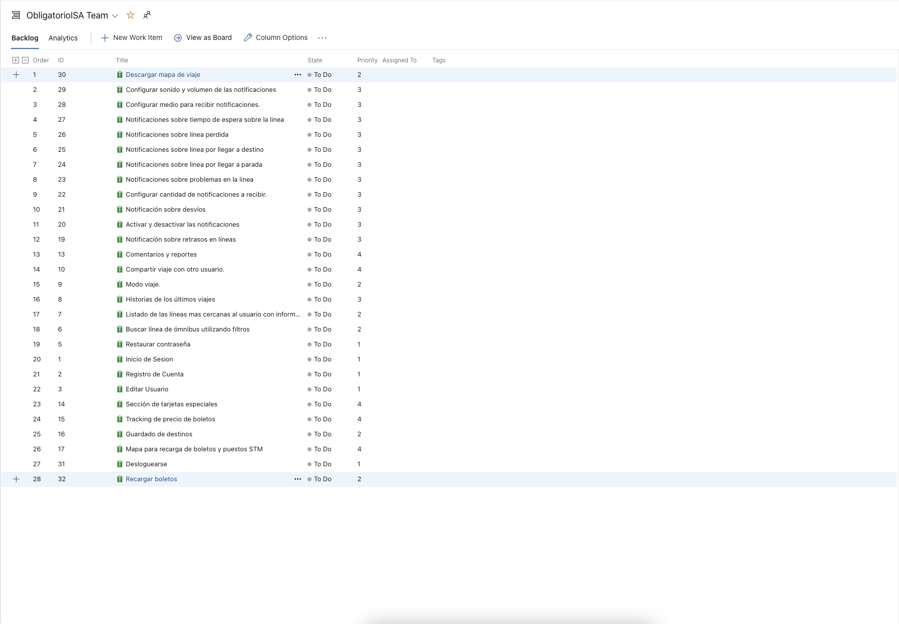
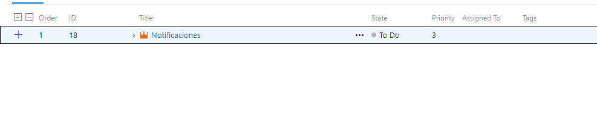
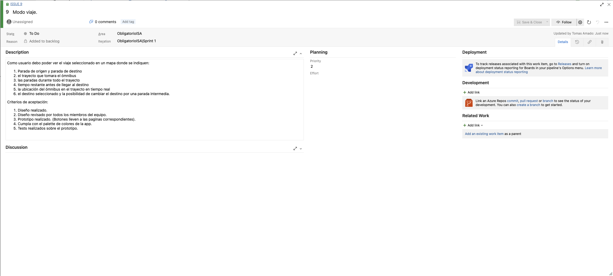

# Sprint 1

## Objetivo del Sprint

Identificar el problema y definir una solucion al mismo.

## Sprint Planning

Definimos que tareas teniamos que hacer, entrevistas, encuestas, etc. Nos dividimos algunas tareas.
Definimos el marco de SCRUM y que eventos y roles vamos a seguir y/o tomar.

## Dailies

### Daily 26-09-2022

- Romi: Hice la investigación de la aplicación de STM, creo que lo que faltaría es ver que mejoras a partir de los pros que encontré se pueden añadir a nuestro producto.
  No eh tenido problemas salvo para entender algunos aspectos de la aplicación que me tocó investigar, pero pude resolverlos. Tengo pendiente hacer el pull request.

- Danilo: Investigacion sobre las secciones de que provee la app "como ir", pros, cons. Voy a agregar algunas observaciones de la misma. No tengo ningun bloquer.

- German: Investigacion sobre la app que me habia tocado, pros, cons, requisitos. No tengo bloquer.

- Tomas: Investigacion sobre Moovit, pros, cons, requisitos, me junte con Romi para ver un poco como empezar el backlog pero no empezamos aun.

### Daily 4-10-2022

- Romi: Trabaje sobre el backlog creando historias de usuario y priorize el backlog. Story Map. Analisis de encuestas y entrevista. Reporte de horas. Retrospective y Review. Creacion de encuestas.

- Danilo: Trabaje sobre product backlog con el equipo. Story Map. Analisis de encuestas y entrevista. Reporte de horas. Retrospective y Review.

- German: Trabaje sobre product backlog con el equipo. Story Map. Analisis de encuestas y entrevista. Reporte de horas. Retrospective y Review.

- Tomas: Trabaje sobre product backlog con el equipo. Story Map. Analisis de encuestas y entrevista. Reporte de horas. Retrospective y Review.

## Sprint Review

Nos juntamos con el Product Owner para hacer la review.

En esta meeting revisamos el backlog con el PO y fuimos historia a historia hablando de cada una y discutiendo si estabamos de acuerdo entre todos, preguntando (Dev team) al PO sobre las historias para mas claridad sobre cada una.

Obtuvimos feedback y se agregaron nuevas historias de usuario que faltaban, entre ellas descargar el mapa y pago de boletos desde la app.

## Retrospective

Utilizamos metroretro para hacer la retrospective.

### Reflexión de la retro y oportunidades de mejora
  Durante la retrospectiva los resultados demostraron que el equipo estuvo de acuerdo en que la principal problemática presentada fue la falta de tiempo, se considero la causa que produjo este problema y las reflexiones a partir de esto fueron las siguientes:

  * La falta de tiempo está ligada a que somos un grupo de 4 personas que trabajan y estudian, lo cual no es algo que se pueda modificar, se consideraron como factores sobre los que no se puede actuar. 
  * La falta de tiempo también está ligada a la organización de las diferentes tareas de los integrantes del equipo.

	En esta segunda instancia para resolver estas problemáticas se planteó como mejora separar el trabajo de forma de que cada integrante tenga al menos una tarea en la que pueda avanzar en paralelo con respecto al resto del equipo, lo cual hace más posible que cada integrante pueda acomodar este trabajo a su horario personal. 
  Otra solución propuesta es que las reuniones a las que puedan asistir todos los integrantes del equipo se enfoquen en aquellas actividades que los requieren a todos, realizando más reuniones de una duración menor, 1 hora como máximo.

  Por otra parte se analizaron aspectos positivos del equipo, como el apoyo entre los integrantes, la sincronía de pensamiento y compromiso en la participación de cada instancia.

# Investigacion Moovit

### Cumple con los requisitos

- Tiene notificaciones
- No cuenta con login ni registro de usuarios
- Cuenta con busqueda pero no tiene filtros.
- Cuenta con mapa en vez de listado, de estaciones cercanas al usuario pero no dice cantidad de usuarios en la linea, solamente recorrido, hora de salida y llegada a destino.
- Posee historial de lineas recientemente usadas o vistas.
- Posee modo viaje.
- Se puede compartir los viajes con otros usuarios.

### Pros

- Usa localizacion en tiempo real.
- Se puede setear donde queda el domicilio del usuario.
- Se puede marcar como favoritas las lineas de bus que el usuario desee.
- Se puede reportar varias cosas:
  - La linea estaba llena y no se pudo subir.
  - La data de la aplicacion era incorrecta.
  - Estado del servicio.
- Se puede pedir un Uber desde la app.
- Se puede buscar por calle a donde se quiera ir, y la app sugiere lineas para llegar al destino.
- Posee modo oscuro y modo claro.
- La informacion es clara y concisa.
- La interfaz es comoda de usar y se entiende.
- Posee mapa lo cual ayuda a visualizar donde se encuentra el usuario y donde esta el destino.

### Cons

- Tiene ads requiere de version premium para poder removerlos.
- Al usar geolocalizacion puede que consuma mucha bateria y datos.
- No cuenta con mas informacion sobre el historial del usuario
- No se puede descargar como PDF los datos.
- No cuenta con traqueo de precios de las lineas.
- La lista de recientes indica todos los lugares que se propusieron como puntos de destino/origen/favoritos sin importar si se llavo a cabo el viaje.

### Observaciones

- Muy facil de usar.
- Intuitiva y facil de navegar
- Buen diseño

# Investigacion: STM

### Cumple con los requisitos

- No cuenta con: login, registro de usuarios o contrasenias
- Cuenta con filtros pero son solo de ida/vuelta y tipo de dias
- No contiene historial de viajes (Solo de omnibus tomados, como un filtro)
- No cuenta con modo viaje
- Se puede compartir el viaje en forma de screenshots y mediante otras aplicaciones de mensajeria instantanea mas utilizadas
- Esta disponible para android desde la aplicacion de PlayStore
- No cuenta con informacion de la cantidad de pasajeros en los vehiculos
- No cuenta con notificaciones del viaje

### Pros

- La primera vez que se abre la aplicacion contiene un pequeño tutorial.
- Se puede compartir como vinculo y por las principales aplicaciones de mensajeria.
- Muestra en el mapa ubicaciones de locales para descargar la tarjeta stm.
- Permite ver el saldo de la tarjeta (login en saldos y beneficios)
- Cuenta con bandeja de notificaciones donde se pueden avisos de horarios especiales, cambios de frecuencias, nuevas condiciones al presentar documentos para tarjetas especiales, desvios, lineas especiales, vigencia de boletos, etc.
- Se pueden deshabilitar las notificaciones
- Permite visualizar recorridos
- Permite enviar screenshots
- Permite configurar la primera patalla al iniciar la aplicacion
- Permite eliminar la publicidad
- Permite agregar paradas y muestra los horarios de omnibus que pasan por la misma
- Contiene informacion sobre posibles trasbordos (no muy detallado)
- Contiene una lista de lugares de interes (limitada pero complementaria a la lista de lugares favoritos)

### Cons

- El boton de seleccionar ida y vuelta no es intuitivo, podria parecer que solo se tiene una opcion.
- La informacion parece que se muestra en una pantalla gigante, no tiene indicaciones sobre como ver el contenido completo.
- No cuenta con la opcion para descargar como pdf o archivo de imagen.
- Para aplicar el tema dark, es necesario reiniciar la aplicacion
- Tiene una busqueda de lugares de interes pero estos son fijos (no puedes consultar lugares por nombre que no esten en el listado, si por esquina o numero)
- Indica tiempo de llegada al destino pero en una ventana que dura unos segundos abierta.
- La lista de recientes indica todos los lugares que se propusieron como puntos de destino/origen/favoritos sin importar si se llavo a cabo el viaje.

### Observaciones

- En general resulta poco intuitiva.
- Existen pantallas a las que es dificil retornar.
- Permite guardar las paradas que utiliza el usuario, si bien no es muy intuitiva, podria ser una buena opcion para una persona mayor que frecuenta siempre las mismas ubicaciones, si solo utiliza esta funcionalidad.
- Falta de funcionalidades importantes (seguimiento de viaje).
- La seleccion de origen - destino es complicada.

# Investigacion Como Ir

### Cumple con los requisitos

- No permite ingresar/registrarse con un usuario, del mismo modo no permite editar tu perfil o restaurar una contraseña
- Permite filtrar los omnibus por número y horario
- Permite acceder al listado de lineas con la información de origen/destino/tiempo estimado, pero no a la cantidad de pasajeros en las mismas
- Posee un historial de viajes
- Tiene modo viaje
- Permite compartir tu viaje a otro usuario
- No posee sistema de notificaciones acerca del viaje

### Pros

- Permite registrar targeta STM
- Se pueden seleccionar las ubicaciones en un mapa o escribir el origen y destino en campos de texto
- Tiene un sistema de notificaciones acerca de los precios y de las lineas de omnibus, por ejemplo acerca de paros, cambios de rutas, etc
- Permite una sección de favoritos para guardar tus ubicaciones para futuros viajes
- Permite ver tu ubicación en todo momento en un mapa interactivo

### Cons

- La interfaz es muy poco intuitiva, al momento de seleccionar si ir en bus o a pie desaparece las dos opciones, al menos que se vaya hacia atras, pero el menu principal sigue mostrando lo mismo
- No informa sobre los horarios de llegada de los omnibus
- No se permiten guardar los viajes hechos previamente, solo las ubicaciones

### Observaciones

# Investigacion: CityMapper

### Cumple con los requisitos

- Cuenta con login, inicio de sesión y contraseñas.
- Cuenta con filtros.
- No contiene historial de viajes (Solo de omnibus tomados, como un filtro)
- Cuenta con modo viaje
- Se puede compartir el viaje en forma de screenshots y mediante otras aplicaciones de mensajeria instantanea mas utilizadas
- Esta disponible para android desde la aplicacion de PlayStore
- No cuenta con informacion de la cantidad de pasajeros en los vehiculos
- Cuenta con notificaciones del viaje

### Pros

- La primera vez que se abre la ni siquiera requiere tutorial porque es muy intuitiva.
- Es internacionalmente conocida.
- Esta muy optimizada, corre sin trancazos y con muy linda interfaz gráfica.
- Se puede compartir como vinculo y por las principales aplicaciones de mensajeria.
- Muestra en el mapa ubicaciones de interes y lugares de gran concurrencia
- Se pueden deshabilitar las notificaciones
- Permite visualizar recorridos
- Permite enviar screenshots
- Permite configurar la primera patalla al iniciar la aplicacion
- Permite eliminar la publicidad (opcion paga).
- Contiene una lista de lugares de interes (limitada pero complementaria a la lista de lugares favoritos)
- Permite ver opciones para varios medios de transporte como tren, metro bus, bicicleta, caminata, MetroBus, etc.
- Permite guardar la ubicacion de un hogar para acceder a rutas facilmente. Tambien permit agregar la ubicacion del trabajo y otros sitios de gran relevancia.
- Permite monitorear el ahorro de CO2, calorias quemadas y el dinero ahorrado.

### Cons

- La opcion de pago es muy costosa.
- No tiene nocion de rutas peligrosas.
- Todavia no llego al mercado nacional.
- No cuenta con la opcion para descargar como pdf o archivo de imagen.
- No tiene tema dark.

### Observaciones

- Es muy intuitiva.
- Es rapida.
- Es facil aprender a usarla y hacerse un usuario.
- De presentarse al mercado nacional va a ser un competidor voraz.

# Entrevistas

### Preguntas 
- 1 ¿Conoces alguna aplicación para viajar en ómnibus?
- 2 ¿Usas alguna aplicación para ver tu viaje en ómnibus? 
- 3 ¿Qué ventajas ves en esta?
- 4 ¿Qué desventajas ves en esta?
- 5 ¿Cuales son las funcionalidades más importantes que debería tener
- 6 ¿Te gustaría poder iniciar sesión con google o permanecer anónimo?
- 7 ¿Le gustaría que la aplicación permitiera compartir la ubicación de su viaje en tiempo real?
- 8 ¿Le gustaría que la aplicación tuviera destinos guardados/preferidos?
- 9 ¿Te interesaría que la aplicación permitiera ver en el mapa los puestos de recarga de boletos?
- 10 ¿Te interesaría poder enviar comentarios dentro de la aplicación? (Quejas, sugerencias o comentarios en general)
- 11 ¿Te interesaría que la aplicación tuviera una sección en la cual indique el 
- 12 ¿Se te dificulta el uso de las aplicaciones? ¿Cómo lo mejorarías?
- 13 ¿Te gustaría agregar algo más?

## Entrevistas realizadas

### Entrevista 1

Persona de 57 años que viaja frecuentemente en transporte público.

- 1 Si, “Yo iré”.
- 2 No, utilizo el portal www.montevideo.gub.uy
- 3 Me permite salir a tomar el bus a la hora que este pasa por mi parada, no necesito esperarlo allí, no estoy tanto en la parada en la madrugada y lo puedo ver desde mi celular.
- 4 Que a veces los ómnibus no llevan el gps prendido y no sabes cuando van a llegar o el recorrido que vienen haciendo.
- 5 Me gustaría saber cuál es el horario de salida en pantalla, que 
saber por qué parada está sin tener que agrandar el mapa.
- 6 Prefiero el anonimato.
- 7 Si, sería útil.
- 8 Si. también.
- 9 Si claro, porque a veces no tenes un local como abitab cerca, o hay locales-almacenes que no sabes que podes recargar
- 10 Si, para poder avisar en caso de fallos en el ómnibus.
- 11 Si, porque a veces no te enteras a tiempo si subió el precio de este o la limitación de las zonas para los boletos locales.
- 12 Si, pero es la que más uso. Poder poner varios filtros a la vez, ya que a medida que transcurre el día aumenta el número de ómnibus en la calle aumenta y se dificulta visualizar las rutas, pero si pongo un filtro solo me deja ver una línea a la vez.
- 13 Que te pueda predecir si desde un viaje se puede llegar a alcanzar otro ómnibus.

### Entrevista 2

Joven de 21 años que viaja en transporte publico ocasionalmente.

- 1 Conozco un par, Moovit y STM, alguna más debe haber en la vuelta
- 2 Si, uso Moovit por lo general. También probé STM pero a efectos prácticos es casi lo mismo. 
- 3 Es muy intuitiva y de conocida procedencia, literalmente todo le mundo la usa. 
- 4 Que en mi celular se tranca bastante y no puedo comprarme otro. Además, hay líneas interdepartamentales que no aparecen, y a mi que soy de Canelones me afecta bastante esto.
- 5 Mostrar todas las líneas de ómnibus disponibles y tener un GPS y un mapa para llevarte a la parada mas cercana. 
- 6 Prefiero permanecer anónimo, una sesión de Google no aporta nada en una aplicación de bondi. 
- 7 Si, mas que nada para que la familia se quede tranquila de donde esta uno.
- 8 Si, casa, trabajo y facultad.
- 9 Estaría bueno, así uno si se pierde sabe dónde cargar los boletos.
- 10 La verdad no, nunca uso esa opción en ninguna aplicación, tampoco creo que nadie se ponga a leer verdaderamente las sugerencias. 
- 11 Si, a veces el boleto aumenta de sorpresa y capaz que justo andas con poca plata. Esta bueno ahorrarse estos inconvenientes.
- 12 No, son todas bastante intuitivas. Como dije antes, se trancan mucho. Las haría más rápidas. 
- 13 Si, que las apps todas me gastan mucha batería y tengo que ir abriéndolas y cerrándolas durante el recorrido.

### Entrevista 3

Joven de 20 años que utiliza ocasionalmente el transporte publico.

- 1 Si, STM, Moovit, Comoir.
- 2 Si, Moovit.
- 3 Lineas favoritas.
- 4 No siempre tiene ubicación en tiempo real.
- 5 Todas las lineas, valor del boleto, frecuencia.
- 6 Me da lo mismo.
- 7 Si.
- 8 Si.
- 9 Si.
- 10 Si, creo que si.
- 11 Si, me encantaría.
- 12 Si, sacandole los anuncios.
- 13 No.

# Resultados Encuesta

# Analisis de resultados de investigacion

## Los principales resultados obtenidos en las investiaciones realizadas fueron:

* Las personas que respondieron las encuestas que más suelen utilizar este tipo de aplicaciones se encuentran entre los 19 y 30 años de edad. Siendo seguidos en menor proporción tanto por las edades entre 31 y 40 años como por los mayores de 51 años, ademas en la entrevista realizada se dejo ver que existen personas de edad avanzada que suelen usar estas aplicaciones. Por esta razon nos centramos en estos rangos de edades como público objetivo.
* La gran mayoría de los encuestados utilizó en el pasado, usa ocasionalmente o muy seguido una aplicación de transporte público. Las aplicaciones STM y Moovit son unas de las más conocidas. De estas obtenemos gran referencia para nuestra propia aplicación como por ejemplo:  
- STM : 
- Muestra en el mapa ubicaciones de locales para descargar la tarjeta stm
- Permite ver el saldo de la tarjeta (login en saldos y beneficios)
- Cuenta con bandeja de notificaciones donde se pueden avisos de horarios especiales
- Se pueden deshabilitar las notificaciones
- MOOVIT:
- Se puede reportar varias
- Posee mapa lo cual ayuda a visualizar donde se encuentra el usuario y donde esta el destino.
- Intuitiva y facil de navegar
* Cerca de un cuarto de los encuestados afirmó presentar dificultades en el manejo de una aplicación de esta índole, ademas el entrevistado de mayor edad confirmo estas dificultades. Por lo cual trataremos de que nuestro disenio sea lo mas intuitivo posible.
* Más del 60% de los encuestados les gustaría tener la posibilidad de utilizar la aplicación de forma anónima y más del 40% de los encuestados les gustaría tener la posibilidad de utilizar la aplicación iniciando sesión con su cuenta de google. Por lo tanto se agregaron estas posibilidades.
* La mayor parte de los encuestados y todos los entrevistados consideraron que las funcionalidades de compartir la ubicación de su viaje en tiempo real, así como tener destinos favoritos son funcionalidades útiles, ademas es un pro encontrado en la mayor parte de las apps investigadas. Por lo cual estas dos funcionalidades se agregaron.
* La sección para ver precios de boletos así como la funcionalidad de ver puestos de recarga en el mapa fueron mayoritariamente aceptadas por los encuestados y entrevistados. Se agrego la posibilidad de realizar estas actividades dentro de la aplicacion.
* La funcionalidad de recarga de boletos dentro de la aplicacion fue mayoritariamente aceptada por los encuestados, sumado a que algunos encuestados añadieron la necesidad de tener tarjetas de pago dentro de la aplicación para poder cargar boletos desde allí nos llevo a contemplar esta opcion dentro de las funcionalidades de nuestra aplicacion.
* Sobre las notificaciones, más del 90% de los encuestados desea tener la posibilidad de realizar ajustes sobre las mismas, ademas como indican que le molestan los anuncios esta funcionalidad agregaria valor.
* En la primer pantalla de la aplicación la mayor parte de los encuestados quiere visualizar la opción para realizar un nuevo viaje y la siguiente es visualizar el mapa, es por esto que consideraremos estas dos opciones para el inicio de la aplicacion.
* Envio de comentarios, la mayoria de los entrevistados y mas del 60% de los encuestados estan a favor de poder enviar comentarios o quejas dentro de la aplicacion. Esto se tomara en cuenta para la implementacion.

# Descripcion de interesados

## Los grupos de interesados constan de:

### Jóvenes adultos y estudiantes: 
  Este grupo engloba todos los jóvenes y/o estudiantes menores de 30 años de edad, los cuales suelen frecuentar los transportes públicos como medio de locomoción al estudio o trabajo, además suelen ser más activos y salir más seguido en toda la franja horaria del día. También se considera que son el rango que más podría utilizar la aplicación debido a su afinidad con la tecnología.
### Adultos y frecuentadores de transporte público: 
  Este grupo comparte varias de las características del grupo anterior pero se enfoca en una edad más madura de 30 a 50 años, donde existe familiaridad con la tecnología pero en algunos casos más restringida que en edades inferiores. Muchos adultos en esta edad tienen vehículo propio pero nos enfocamos en aquella gran parte de la población que se transporta toda su vida en transporte público. 
### Adultos mayores: 
  Este grupo involucra a todos los mayores de 51 años capaces de manejar una aplicación básica, este grupo es más reducido debido a que a mayor edad existe una menor afinidad con la tecnología. Existen personas que cuentan con beneficios para viajar en transporte público y los frecuentan, involucrando también a antiguos conductores que debido a su edad o por alguna incapacidad prefieren este tipo de transporte. Es posible que estas personas prefieren tener todo lo referido a su viaje en una sola aplicación y no buscar en internet u otras aplicaciones y sin duda se verían beneficiados al tener opciones offline. 

# Funcionalidad por interesado

* Las funcionalidades que interesan a todas las edades son:
  * Notificación sobre desvíos
  * Activar y desactivar las notificaciones
  * Notificaciones sobre retrasos en la línea
  *	Notificación sobre línea por llegar a destino
  *	Historias de los últimos viajes
  *	Listado de las líneas más cercanas al usuario con información
  *	Buscar línea de ómnibus utilizando filtros
  *	Restaurar contraseñas
  *	Listado de las líneas más cercanas al usuario con información
  *	Buscar línea de ómnibus utilizando filtros
  *	Guardado de destinos
  *	Modo viaje
  *	Tracking de precio de boletos
  *	Configurar cantidad de notificaciones a recibir.

* Las funcionalidades que interesan a sujetos de entre menores y 30 años son:
  *	Configurar medio para recibir las notificaciones
  *	Notificación sobre línea perdida
  *	Notificación sobre línea por llegar a parada
  *	Notificación sobre problemas en la línea
  *	Comentarios y reportes
  *	Compartir viaje con otro usuario
  *	Editar usuario
  *	Registro de cuenta 
  *	Inicio de sesión
  *	Recargar boletos desde la app.

* Las funcionalidades que involucran a sujetos de entre 30 y 50 años son:
  *	Notificación sobre línea perdida
  *	Descarga mapa de viaje
  *	Notificaciones sobre tiempo de espera sobre la línea
  *	Notificación sobre problemas en la línea
  *	Notificación sobre desvíos
  *	Comentarios y reportes
  *	Editar usuario
  *	Registro de cuenta 
  *	Inicio de sesión
  *	Recargar boletos desde la app.

* Las funcionalidades que interesan a sujetos mayores de 51 años son:
  *	Descarga mapa de viaje.
  *	Configurar sonido y volumen de las notificaciones.
  *	Notificación sobre línea por llegar a parada.
  *	Notificación sobre problemas en la línea.
  *	Tracking de precio de boletos.
  *	Sección de tarjetas especiales.
  *	Mapa para recarga de boletos y puestos STM.

# Story Map

[Story Map](https://miro.com/app/board/uXjVPP7CXlM=/?share_link_id=835092374517)

# Product Backlog (Priorizado 1-4)

# Historia de Usuario y Criterios de Aceptacion

### Ejemplo:

# Reporte de horas

[Reporte de horas](https://docs.google.com/spreadsheets/d/1Kh862NqWlY94nU2gIDmNjZJNJ3PDnCxO8ejniM3c5-s/edit?usp=sharing)

