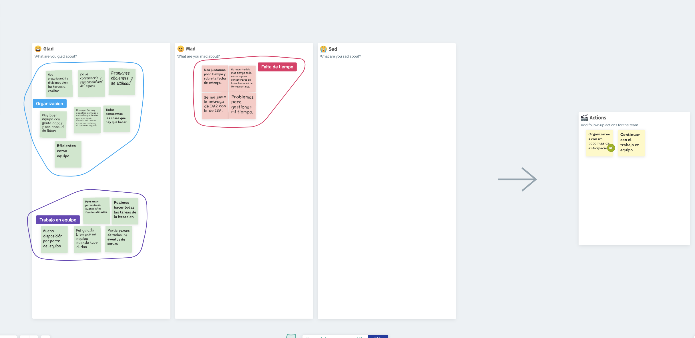

# Sprint 2

## Objetivo del Sprint

Prototipado de diseños iniciales, para que el usuario pueda iniciar sesión en la aplicación.

## Sprint Planning

Tuvimos una meeting que duro alreadedor de 2:30 horas donde estuvimos hablando con Romi (Product owner)
con la cual decididimos cuales tareas eran las que aportaban mas valor, también creamos nuevas historias del feedback que
recibimos.
Luego sobre este set inicial de historias utilizamos Planning Poker para estimar las historias.

Para el Poker utilizamos https://www.scrumpoker-online.org.

Finalmente, dividimos las tareas entre el development team.

## Dailies

### Daily 14-10-2022

- Romi: Reflexión de la retro y oportunidades de mejora, descripción más detallada de los interesados, corrección del story map.
Tengo planeado terminar de documentar el análisis de resultado de entrevista, encuesta y funcionalidad por interesado. Tenia dudas sobre algunos análisis que habíamos realizado previamente para documentarlos correctamente pero se resolvieron en la daily.

- Danilo: Trabaje en dividir por iteraciones el story map dado el feedback de la iteracion anterior.

- German: Trabaje sobre los diseños, especificamente sobre mi historia de usuario asignada.

- Tomas: Comence con los diseños iniciales sobre inicio con icloud, historia 37.

### Daily 18-10-2022

- Romi: Trabaje sobre la historia 1 y 31 (Inicio sesion y Desloguearse). Para la historia 31, tuve que esperar a que la pagina de perfil de usuario este terminada.

- Danilo: Trabaje sobre la historia 3 y 36 (Editar usuario e Iniciar Viaje). Para la historia 36, tuve que esperar a que la pagina del mapa este terminada.

- German: Trabaje sobre la historia 33 y 35 (Inicio con google e Mapa ubicacion actual).

- Tomas: Trabaje sobre la historia 37, 2 y 34 (Inicio con iCloud, registro de cuenta y navegacion de la applicacion).

### Daily 21-10-2022

- Romi:

- Danilo: 

- German: 

- Tomas: Trabaje sobre las historia 29, 28, 22, 20 y 30 (Configuracion de volumen notificaciones, configuracion medio nofitificaciones, configuracion cantidad nofitificaciones, activar/desactivar notificaciones y descargar mapa viaje).

## Verificaciones con usuarios

### Contexto de las pruebas

Las pruebas se realizaron bajo el siguiente contexto:
- El usuario sabía que se trataba de un prototipo, que alunas funcionalidades no estaban implementadas y que por ejemplo no se pueden editar los textos de las casillas por el momento.
- Se probo en dispositivos soportados por la aplicación, aquellos que tienen formato Android Large.

### REVISIÓN 1: 27 años

- Flujo realizado por la persona:

La persona ingresó a la aplicación registrando, luego inicia sesión, en el mapa intenta seleccionar origen y destino, ve la pantalla del mapa, lo mueve, selecciona el botón de centrarse en la ubicación actual, se dirige a los botones en la parte inferior, empieza por el botón más a la izquierda pasando por todas las funcionalidades hasta el botón más a la derecha, vuelve al primer botón y examina el contenido y le da al botón editar, allí hace tap en las opciones de edición, al llegar a la fecha se despliega el calendario y e intenta seleccionar una fecha, debe realizar scroll para guardar los cambios. pasa al botón del centro donde se encuentra el mapa, realiza doble clic en el mapa, pasa al botón de perfil y selecciona cerrar sesión, selecciona el botón de iniciar sesión con google y termina la prueba.
 
- ¿Qué funcionalidades entiende que realiza? 

RE: “Tenés la opción de registrarse, iniciar sesión con usuario y sin usuario, podes ver un mapa con tu ubicación y seleccionar una línea de ómnibus, tenés una ventana para ver tu perfil y actualizarlo, además podés cerrar la sesión.”

- ¿Le parece que se cumplen? 

* Inicio de sesión, tanto en modalidad anónima como por google e iCloud y la funcionalidad de cerrar la sesión (Considera que se cumple)
* Permitir registrarse en la aplicación / crearse una cuenta que no sea con el correo de google (Considera que se cumple)
* Edición del perfil del usuario y sus datos (Considera que se cumple)
* Presentar la opción de un mapa con la ubicación actual del usuario y un vistazo de cómo se realizará la consulta para iniciar viajes ingresando origen y destino (Considera que se cumple, pero falta mejorar, como poder ingresar diferentes destinos)
* Mostrar la navegación que tendrá la app a todas las ventanas de la aplicación (Considera que se cumple)

- ¿Qué opina de los colores seleccionados, le pareció agradable a la vista? 

RE: “Los colores me parecen acertados, se ve tranquilo, se ven los textos y los iconos.”

- ¿Cómo le resultó la navegación? (registrar respuestas)

RE: “Siento que se entiende, me gusta que los botones no tengan texto, los iconos elegidos están bien, no se ve como la pantalla muy saturada. Se parece a aplicaciones que he utilizado antes.”

- ¿Tiene algo para comentar/agregar? (registrar respuestas)

RE: “Entiendo que este es un prototipo y no están todas las funcionalidades, las que están me parece que cumplen, pero después me interesaría ver más interacción, poder escribir mi nombre y apellido, poder ver el tiempo que me queda para tomar el bus de la línea que seleccione y en qué parada hacerlo.”

### REVISIÓN 2: 50 años

- Flujo realizado por la persona:

La persona inicia la aplicación ingresado con usuario anónimo, se le presenta el mapa centrado en su ubicación, selecciona el botón de modo viaje, al estar sin implementar regresa al botón de en medio, selecciona el icono de centrado en la ubicación realizando doble clic, intenta iniciar un viaje en la opción que se encuentra en la lupa en la parte superior de la ventana, aparece su viaje en pantalla y se desplaza por el siguiendo la trayectoria marcada, selecciona el botón de comentarios y luego pasa al botón de configuraciones, por ultimo selecciona el primer botón e intenta editar su perfil terminando la prueba.
 
- ¿Qué funcionalidades entiende que realiza? (registrar respuestas)

RE: “Podes ver en el mapa donde estas y armar un viaje con punto de partida y fin, podes tener datos, además tenés la opción de tener una cuenta.”

- ¿Le parece que se cumplen? (registrar respuestas)

* Inicio de sesión, tanto en modalidad anónima como por google e iCloud y la funcionalidad de cerrar la sesión (No lo probo)
* Permitir registrarse en la aplicación / crearse una cuenta que no sea con el correo de google (Considera que se cumple)
* Edición del perfil del usuario y sus datos (Considera que se cumple)
* Presentar la opción de un mapa con la ubicación actual del usuario y un vistazo de cómo se realizará la consulta para iniciar viajes ingresando origen y destino (Considera que se cumple)
* Mostrar la navegación que tendrá la app a todas las ventanas de la aplicación (Considera que se cumple)

- ¿Qué opina de los colores seleccionados, le pareció agradable a la vista?

RE: “Está lindo, me parece que los colores pegan bien y no son muy fuertes.”

- ¿Cómo le resultó la navegación? 

RE: “Entendí bastante bien, pero me faltaría algún texto para saber en que ventana estoy o que me marque con color.”

- ¿Tiene algo para comentar/agregar? 

RE: “No entendí mucho como se dónde están las paradas, me aparecieron datos de cuenta aunque entre de forma anónima, aparte de eso me gusta, si bien pienso que le falta texto, esta bueno que no sea mucho así las personas como yo que vemos menos podemos usarla sin tanto problema.”

## Sprint Review

## Retrospective

Utilizamos metroretro para hacer la retrospective.

# Reporte de horas

[Reporte de horas](https://docs.google.com/spreadsheets/d/1Kh862NqWlY94nU2gIDmNjZJNJ3PDnCxO8ejniM3c5-s/edit?usp=sharing)

